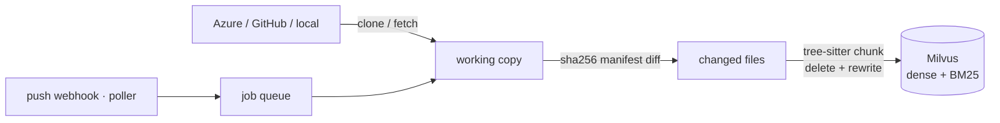
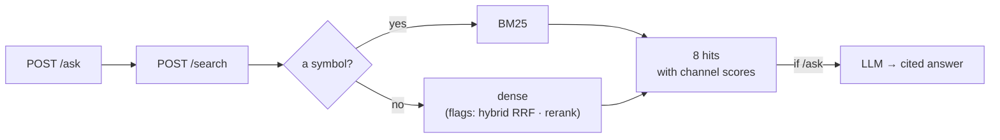
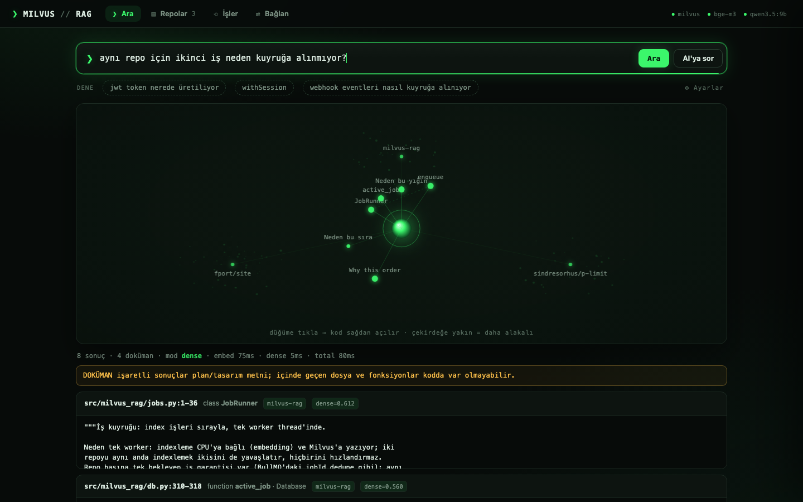

<p align="center">
  
</p>

<h1 align="center">Milvus RAG</h1>

<p align="center"><em>A search service that understands a codebase and refreshes itself on push.</em></p>

<p align="center">
  <strong>English</strong> · <a href="README.tr.md">Türkçe</a>
</p>

<p align="center">
  <a href="#why-this-stack">Why this stack</a> ·
  <a href="#setup">Setup</a> ·
  <a href="#usage">Usage</a> ·
  <a href="#what-happens-when-the-repo-changes">Refresh flow</a> ·
  <a href="#retrieval-chain-and-flags">Retrieval</a> ·
  <a href="#measurement-ledger">Measurement ledger</a> ·
  <a href="DEPLOYMENT.md">Deploying to a server</a>
</p>

<p align="center">
  <a href="https://fport.github.io/milvus-rag/"><strong>Documentation — what was built, and why</strong></a> ·
  <a href="https://fport.github.io/milvus-rag/rag/">The RAG ladder</a>
</p>

---

You pick a repo from Azure DevOps or GitHub; the service clones it, splits it into code
units with tree-sitter, and writes it to Milvus with BGE-M3 (dense) + BM25 (sparse). At
query time, symbol-shaped queries go to BM25 and plain sentences go to dense (hybrid RRF
and cross-encoder rerank are behind flags — both were measured, see the table). When a
push lands, only the changed files are re-indexed.





## Why this stack

The hard part of RAG over a codebase is not the vector search. Four things are hard:
**finding a symbol exactly**, **connecting a question in another language to English
code**, **not going stale when the repo moves**, and **being able to say "no answer"
when there isn't one**. Every piece here was picked against those four; every decision
that could be measured is marked "measured" below, with the number in the
[measurement ledger](#measurement-ledger).

| Piece | What it does | Why this one | Alternatives — why not |
|---|---|---|---|
| **Milvus 2.6** (Docker) | Vector store: dense + BM25 sparse in one collection, `repo_id` as partition key | Milvus' own `Function` produces BM25 → no separate lexical index to maintain; the partition key makes repo filtering cheap; range search available | **pgvector**: no BM25, hybrid needs a separate tsvector path · **Qdrant**: has a sparse field but BM25 is computed client-side · **Chroma / FAISS**: single process, weak filtering and scale · **Elasticsearch**: good hybrid, but a separate world and heavy |
| **BGE-M3** (local, 1024d) | Turns a plain sentence into a vector; a Turkish question and English code land in the same space | Multilingual: Turkish prose R@8 0.684 — MiniLM scored 0.04 (measured); the code never leaves the machine; 8192-token window | **OpenAI text-embedding-3**: good, but the code goes out and it costs (enable with `RAG_EMBEDDING_BACKEND=openai`) · **MiniLM**: collapsed on Turkish (measured) · **Voyage-code**: API, same reason |
| **BM25** (Milvus sparse) | Finds symbols like `handleAuthCallback`, `QUEUE_NAMES` exactly | Embeddings are blind to symbols; BM25 scores 1.0 / 1.0 on them (measured) | **Dense only**: MRR 0.875 on symbols · **grep**: live but no meaning or ranking — and that is already the agent's own tool |
| **Query routing** (regex) | Symbol-shaped query → BM25, plain sentence → dense | Free MRR: 0.678 → 0.690; always-on hybrid also promotes the channel that failed to find it (MRR 0.604) (measured) | **Always hybrid RRF**: worse (measured) · **LLM router**: latency + cost, one regex is enough |
| **RRF** (flag) | Merges the dense and BM25 lists *by rank* | Cosine (0–1) and BM25 (0–30) cannot be summed; RRF looks at rank, not score | **Weighted sum / Milvus WeightedRanker**: even normalized, it drifts with the corpus |
| **Cross-encoder rerank** bge-reranker-v2-m3 (flag, off) | Reads 40 candidates side by side with the question and re-orders them | Measured: it broke the ordering on this corpus (MRR 0.690 → 0.514), p50 2–4 s → off. The recall@40 = 0.95 gap is still there; a better reranker earns a row in the table | **Cohere / Voyage rerank**: API; not tried |
| **tree-sitter** chunking | Splits files on function / class / method boundaries and carries the symbol name; language coverage is a rule, not a hand-written table — the pack's 371 grammars (extension name = grammar name, plus a small alias table) | Chunk = code unit: a citation becomes "file:line — function", and the embedding represents exactly one thing | **Fixed window / RecursiveCharacterTextSplitter**: cuts a function in half · **LLM chunking**: expensive · `.sql` is outside tree-sitter here: the grammar segfaults (measured), so it is split with line windows |
| **sha256 manifest** for incremental sync | On push, only the changed files are re-indexed | Content hashing: no rename / mode / submodule edge cases, and local directories take the same path; an interrupted job never leaves a gap | **git diff**: edge cases · **Full re-index**: 300 files ≈ minutes |
| **Webhook + poller** | Azure "Code pushed", GitHub push (HMAC); the poller catches whatever the webhook misses | Freshness at push time, with the poller as the safety net | **Cron only**: a stale window · **Webhook only**: a missed event is a permanent gap |
| **SQLite** + single-worker queue | repos / files / jobs / webhook_events; one pending job per repo | One process, one file; no Postgres + Redis to install | **Postgres + Celery / BullMQ**: two extra services with nothing to do here |
| **scrub** (regex) | Redacts secrets and PII before anything is indexed | Deliberately conservative: on the same repo, a name-based rule produced 247 false positives; this version produces 2 (one of them real) (measured) | **detect-secrets / gitleaks**: a dependency, and the same false-positive problem |
| **Three bands** (0.45 floor · 0.55 note) | Says "no answer" when there is none; returns the grey zone with a warning | kNN never says "nothing is close"; cosine does not separate in the grey zone (lowest real hit 0.526 / highest junk 0.587) → not a hard gate, but a signal plus an adjudicating agent (CRAG's three bands) | **A single cosine threshold**: cuts real answers too · **Reranker gate**: 29% false alarms, +550 ms (measured) · **LLM judge**: one LLM call per query |
| **MCP** (same process, `/mcp`) | `search_code` · `read_code` · `list_repos` for Claude Code / Cursor | Same retriever, no extra process; the agent gets candidates and decides by reading the rest; `read_code` only opens indexed files | **stdio in a separate process**: the model loads twice · **HTTP only**: every agent tool has to be wrapped by hand |
| **Golden eval** (Recall@k · MRR · abstain) | Puts a number on every retrieval decision | 42 questions + 13 negatives; no "feels better", and no flag default changes without a JSON landing on disk | **Ragas / TruLens**: LLM-judged, slow and expensive; measuring retrieval directly is enough |
| **LLM layer** (`auto`: Claude › OpenAI › local Ollama) | Cited answers (`/ask`); optional per-chunk descriptions | Retrieval works with no LLM at all — the LLM lives only in the answer layer; with no key, local `qwen3.5:9b` gives you a zero-setup start (measured, Setup → Local LLM) | **Cloud only**: cannot be tried without a key · **Local only**: a quality/speed ceiling; both are behind flags · qwen2.5 drifts into Chinese during enrichment (measured) → an alphabet check |

Around it: Python 3.12 + uv, FastAPI + uvicorn, a typer CLI, pydantic-settings; one
`docker compose` brings up Milvus + etcd + MinIO. It talks to the outside world over HTTP
only, and never writes to the repos it indexes. This table is the summary; the reasoning
and the traps behind each row are in [Design notes](#design-notes).

## Setup

```bash
git clone git@github.com:fport/milvus-rag.git && cd milvus-rag
uv sync                                              # Python 3.12 + dependencies (uv fetches them)
docker compose -f infra/docker-compose.yml up -d     # Milvus 2.6 + etcd + MinIO
curl -f http://localhost:9091/healthz                # "OK" (~60-90 s on first boot)
docker compose -f infra/docker-compose.yml --profile ui up -d   # (optional) Attu, the Milvus UI → :8091
ollama pull qwen3.5:9b                               # local LLM (6.6 GB) — /ask runs on this, no key needed
cp .env.example .env                                 # fill in the values below (none are required for a local trial)
```

If Ollama is not installed: on macOS `brew install ollama && brew services start ollama`,
on Linux `curl -fsSL https://ollama.com/install.sh | sh`. Model options and measurements
are under [Trying it with a local LLM](#trying-it-with-a-local-llm-the-default).

What `.env` needs — to try it against a local directory with a local LLM, **none of it**:

| Variable | What |
|---|---|
| `AZURE_DEVOPS_ORG_URL` | `https://dev.azure.com/<org>` |
| `AZURE_DEVOPS_PAT` | Personal Access Token, scope **Code → Read** |
| `GITHUB_TOKEN` | optional — public repos work without a token; private ones need a fine-grained PAT (Contents: Read) |
| `RAG_WEBHOOK_SECRET` | the shared secret an Azure Service Hook will send |
| `ANTHROPIC_API_KEY` | optional — if set, `/ask` and enrichment switch to Claude; otherwise the local Ollama model (see below) |

All of them can be entered from the UI too, and what you enter overrides `.env` (clear it
and it falls back to the env): the GitHub token and Azure org+PAT live in the
**Repos › Connect repo** panel, the webhook secret and Anthropic key in the
**Connect › Keys** card. They are verified, stored in `data/rag.db`, and need no restart.

### Trying it with a local LLM (the default)

The provider is `RAG_LLM_PROVIDER=auto`: Claude if an Anthropic key is present, otherwise
OpenAI if an OpenAI key is present, otherwise **local Ollama** — so `/ask` works with zero
keys. Retrieval (`/search`, MCP) does not depend on an LLM at all.

```bash
# 1. Ollama: https://ollama.com/download  (macOS: brew install ollama · Linux: curl -fsSL https://ollama.com/install.sh | sh)
ollama pull qwen3.5:9b                 # 6.6 GB; on a weaker machine qwen3.5:4b (3.4 GB) → RAG_LLM_MODEL=qwen3.5:4b
# 2. Keep the Ollama app running (or `ollama serve`), then:
#    if `ollama pull` says "run ollama serve", the server is down: on macOS open the app
#    (with a brew install, `brew services start ollama`), on Linux `sudo systemctl enable --now ollama`,
#    or run `ollama serve` in another terminal. Check: curl localhost:11434 → "Ollama is running"
uv run rag add-local ~/code/my-api --name my-api
uv run rag ask "how are webhook events queued?" -r my-api
```

The **Connect › Keys** card in the UI shows live whether Ollama is up and whether the model
has been pulled, and prints the command to run if something is missing. Thinking models
(qwen3.x) are called with thinking off — a cited answer does not need it, and it cuts the
time by 2-3x. The context window is `RAG_OLLAMA_NUM_CTX=16384`: Ollama's 4k default silently
truncated an 8-chunk prompt.

Another model from Hugging Face, served by an **OpenAI-compatible** server such as
vLLM / LM Studio / llama.cpp:

```bash
vllm serve Qwen/Qwen3.5-9B --port 8000          # or LM Studio → Local Server
RAG_LLM_PROVIDER=openai RAG_OPENAI_BASE_URL=http://localhost:8000/v1 \
RAG_LLM_MODEL=Qwen/Qwen3.5-9B OPENAI_API_KEY=local uv run rag serve
```

Measured (2026-09-01, Apple M-series, same 6-chunk prompt, 3 questions — Turkish, English,
and one with no answer in the corpus):

| Model | time / answer | Quality | "No answer" behaviour |
|---|---|---|---|
| **qwen3.5:9b, thinking off** ✓ | 12-17 s | good: cited [1][2][4], the right snippet, clean Turkish (it answered the English question in Turkish too) | correct: "there is nothing in the codebase that answers this", 2 s |
| qwen3.5:9b, thinking on | 48-51 s | **empty answer** on 2 of 3 questions: thinking ate all 1024 tokens → we send it off | — |
| qwen2.5:7b | 22-32 s | good: cites file + function, keeps the question's language | correct: "I cannot answer, no snippets were found", 4 s |
| qwen3:1.7b, thinking off | 11-15 s | weak: mangled words, invented terms | unstable, drifts off topic |
| claude-opus-5 | — | the reference; `auto` switches to it once a key is set | correct |

If you use a local model for enrichment (chunk descriptions) there is an alphabet check:
qwen2.5 drifts into Chinese under load (measured), and the wrong alphabet is rejected.

On the first run `BAAI/bge-m3` (~2.2 GB) and `BAAI/bge-reranker-v2-m3` (~2.2 GB) are
downloaded from Hugging Face; after that they come from `~/.cache/huggingface`. On Apple
M-series machines `mps` is selected automatically.

## Usage

```bash
uv run rag serve   # http://localhost:8090 → web UI · /docs → OpenAPI

# Browse Azure, pick a repo
uv run rag azure projects
uv run rag azure repos Platform
uv run rag add-azure Platform backend-api         # registers + clones + indexes
uv run rag add-azure Platform backend-api --branch develop

# Pick a repo from GitHub (public ones need no token)
uv run rag github repos sindresorhus
uv run rag add-github sindresorhus/p-limit
uv run rag add-github acme/backend --branch develop

# Try it against a local directory (it does not have to be a git repo)
uv run rag add-local ~/code/my-api --name my-api

# Search / ask / measure
uv run rag search "how are webhook events queued" -r my-api
uv run rag search withSession --mode bm25
uv run rag ask "how does the optimistic lock work?" -r my-api
uv run rag eval evals/golden.example.jsonl -r my-api --tag v1   # copy the template and fill it in

# Credentials can also be saved from the UI: enter the GitHub token / Azure org+PAT in the
# Repos → Connect repo panel; they are verified, stored in data/rag.db, override the env,
# and you pick repos from a list.

# Refresh
uv run rag sync my-api                            # incremental: only the changed files
uv run rag sync my-api --force                    # full re-index
uv run rag poll                                   # check the Azure heads once
```

The same operations are available over HTTP. There is also a small web UI at `/` with three
tabs: **Search** (search with channel scores, ask the LLM), **Jobs** (the pipeline of every
index run: source → diff → chunk → embed → Milvus, with live progress), and **Connect**
(copyable webhook URLs, the poller, curl examples, MCP setup):

<p align="center">
  
</p>

The search in that image runs against this repo itself: a plain-language question → the dense
channel → `JobRunner` in `jobs.py`, 62 ms. The **DOCUMENT** badge separates hits that come
from design notes from hits that come from code — one of them here is `README.tr.md`, which
a Turkish heading answers an English question from, because BGE-M3 is multilingual.

| Endpoint | Job |
|---|---|
| `GET /health` | Milvus, model and Azure status |
| `GET /azure/projects`, `GET /azure/projects/{p}/repos` | browse Azure (the `registered_as` field is filled in if already registered) |
| `GET /github/{owner}/repos` | GitHub org/user repos (with the same `registered_as` field) |
| `POST /repos` | register + index — `{provider:"azure", project, repo}` · `{provider:"github", repo:"owner/repo"}` · `{provider:"local", path}` |
| `GET /repos`, `GET /repos/{id}`, `DELETE /repos/{id}` | status (including the active job), deletion |
| `POST /repos/{id}/sync` `{force?}` | the job is queued → 202 |
| `GET /repos/{id}/files`, `GET /repos/{id}/file?path=&start=&end=` | the manifest; a line range from a file (an agent's `read_file`) |
| `GET /jobs`, `GET /jobs/{id}` | job history and progress (`stats.progress`) |
| `POST /search` | `{q, repo_ids?, k?, mode?, rerank?, candidates?, path_prefix?, lang?, category?}` |
| `POST /ask` | same body → `{answer, sources[]}` |
| `POST /webhooks/azure/push` | the Azure Service Hook target |
| `POST /webhooks/github/push` | the GitHub webhook target (HMAC-SHA256 signature verified) |

Every `/search` result carries its channel scores — you can see which channel found what:

```json
{"path": "src/features/jira-webhook/jira-webhook.queue.ts", "symbol": "enqueueWebhookEvent",
 "start_line": 41, "end_line": 62,
 "scores": {"dense": 0.71, "bm25": 14.2, "rrf": 0.0325, "rerank": 0.93}}
```

## What happens when the repo changes

1. **Trigger.**
   - *Azure:* Project Settings → Service Hooks → *Web Hooks* → event **Code pushed**,
     URL `https://<host>:8090/webhooks/azure/push`, with either the "Basic authentication
     password" or the `X-RAG-Webhook-Secret` header = `RAG_WEBHOOK_SECRET`.
   - *GitHub:* repo → Settings → Webhooks → Add webhook: URL
     `https://<host>:8090/webhooks/github/push`, content type `application/json`,
     **Secret** = `RAG_WEBHOOK_SECRET` (the HMAC-SHA256 signature is verified),
     event: *Just the push event*.
   - If there is no webhook, or one is missed, the poller compares the Azure/GitHub branch
     head every `RAG_POLL_INTERVAL_SECONDS`.
2. **Queue.** One pending job per repo: if five pushes arrive, one job runs and one waits.
   If the same commit arrives twice (Azure retries), no job is opened.
3. **Diff.** `git fetch` + `reset --hard origin/<branch>`, then the sha256 of every
   indexable file is compared against the SQLite manifest: added / changed / deleted / same.
4. **Write.** For a changed file the chunks at that path are deleted first, then the new
   ones are inserted; a deleted file is only deleted; an unchanged file is never embedded.
   The manifest row is removed before the delete and put back after the write — an
   interrupted job never leaves a gap.
5. **Cache.** When the job finishes the search cache is cleared, so no answer keeps showing
   old line numbers.

If a `RAG_*` chunk/embedding setting changes, `index_version` changes with it and the next
sync does a full re-index.

## Retrieval chain and flags

| Flag | Default | What it does |
|---|---|---|
| `RAG_SEARCH_MODE` | `auto` | symbol-shaped query (`handleAuthCallback`, `QUEUE_NAMES`, `a.b.c`) → BM25; plain sentence → `RAG_PROSE_MODE` |
| `RAG_PROSE_MODE` | `dense` | `dense` or `hybrid` (dense + BM25 → RRF, `RAG_RRF_K=60`) — measured, see below |
| `RAG_RERANK_ENABLED` | `false` | `RAG_CANDIDATES=40` candidates → `bge-reranker-v2-m3` → `RAG_TOP_K=8` — measured, it hurt |
| `RAG_CHUNK_MAX_BYTES` / `MIN` | 2000 / 200 | chunk bounds (≈500 tokens at the ceiling) |
| `RAG_ENRICH_ENABLED` | `false` | an LLM description for every chunk, added to `indexed_text` (cached) |
| `RAG_ENRICH_LANGUAGE` | `English` | the language those descriptions are written in — the measured gain comes from prose in the language people ask in |
| `RAG_MIN_DENSE_SCORE` | `0.45` | hard floor: a chunk scoring below it is never returned (counted as `dropped`); not applied to BM25; 0 = off — measured, see below |
| `RAG_WEAK_DENSE_SCORE` | `0.55` | if the best dense score is below it, the response carries `weak_match: true` — **a signal, not a filter**; the results still come back — measured, see below |

Every flag can be overridden per request in the `POST /search` body and in `rag eval`
parameters; it was designed for ablation.

### Measurement ledger

Every `rag eval` run writes `evals/results/<date>_<tag>.json`. The golden set template is
`evals/golden.example.jsonl`; copy it and fill it in for your own repo (repo-specific sets
are gitignored — do not publish your internal file paths). The numbers below are from an
example corpus (a 318-file TypeScript API monorepo, 42 questions: 19 English prose,
19 Turkish prose, 4 symbols; the labels were written by reading the repo), k=8:

First measurement (2026-08-31, BGE-M3, chunks 200–2000B):

| Tag | Setting | Recall@8 | MRR | TR-prose R@8 | p50 |
|---|---|---|---|---|---|
| bm25 | BM25 only | 0.405 | 0.240 | 0.263 | 2 ms |
| hybrid | dense+BM25 → RRF | 0.786 | 0.604 | 0.684 | 40 ms |
| dense | dense only | 0.786 | 0.678 | 0.684 | 32 ms |
| **auto+dense** ✓ | symbol→bm25, prose→dense | **0.786** | **0.690** | 0.684 | 34 ms |
| hybrid k=40 | candidate pool | 0.952 | — | 0.895 | 39 ms |
| hybrid+rerank | 40→8, bge-reranker-v2-m3 | 0.762 | 0.508 | 0.579 | 4389 ms |
| auto+rerank | same | 0.762 | 0.514 | 0.579 | 2050 ms |

Reading: on symbols BM25 scores 1.0/1.0 and dense 1.0/0.875 — routing buys the MRR for free.
Because BGE-M3 is multilingual, Turkish questions work (in the old MiniLM experiment they
scored 0.04). Recall@40 = 0.95: there IS a +0.17 gap a reranker could close, but instead of
closing it bge-reranker-v2-m3 broke the ordering and ate seconds → off. If a better reranker
gets tried, it enters as a new row in this table.

**Abstention (2026-09-01).** A kNN search means "the nearest k"; it has no concept of
"nothing is near": the retriever returns 8 chunks for "have you ever been to a five-star
resort?" too (best one 0.366). That is where hallucination starts. 12 negative questions
whose answers are NOT in the repo were added to the golden set (`expect: []`); `abstain` =
an empty result or a `weak_match` signal, `false_weak` = the signal firing wrongly on a
positive. Cosine does not separate in the grey zone (golden top-1 dense median 0.636 /
min 0.526; irrelevant median 0.531 / max 0.598 — they overlap). The answer is CRAG's three
bands: **< 0.45 → dropped** (`RAG_MIN_DENSE_SCORE`, well below the lowest real answer in the
golden set, so it only cuts the absurd tail), **0.45–0.55 → returned, but with a "weak
match" note** (`RAG_WEAK_DENSE_SCORE`), **≥ 0.55 → normal**. The decision belongs to the
consumer (agent / LLM / the human in the UI); the floor only clears the "cannot be an
answer" band.

| Gate | abstain (negatives) | false_weak (42 positives) | Recall@8 / MRR | added latency |
|---|---|---|---|---|
| dense < 0.55 note | 10/12 = 0.833 | 2/42 = 0.048 | 0.786 / 0.690 (unchanged) | 0 |
| **floor 0.45 + note 0.55** ✓ | 11/13 = 0.846 (2 came back empty) | 2/42 = 0.048 | 0.786 / 0.690 (unchanged) | 0 |
| rerank < 0.05 (bge-reranker-v2-m3, top-8 only) | 12/12 | 12/42 = 0.286 | — | +550 ms p50 |
| rerank < 0.5 | 12/12 | 25/42 | — | +550 ms |

The thresholds are not universal, they were **measured for this model and this corpus**: the
cosine distribution shifts with the embedding model (for the same job Mistral can land around
0.73 and Gemini around 0.46). Recalibrate when you change the model: the `calibration` block
in the `rag eval` report gives the lowest top-dense among the positives that were found and
the highest among the negatives; put the floor below the first and the note threshold between
the two. It was also checked against a blog repo: 6 real questions scored 0.567–0.700, so
both thresholds were safe.

Reading: the reranker catches the negatives perfectly, but it also gives 0.039 to the p25 of
the real answers — a false alarm on one query in three, enough for an agent to learn to
ignore the note; the cosine note catches them with a 5% false-alarm rate → that is the one
that stayed. The 0.45 floor dropped nothing from the golden set, and took the "resort" (0.366)
and "Kafka rebalance" (0.418) questions down to zero results. The two that got through
("CSV export stream", "puppeteer") are questions where genuinely *similar* code exists in the
repo (0.598 / 0.544); there, the decision is the agent's. How the signal is presented: see the
MCP section and the UI (the weak-match note, the DOCUMENT badge, "N dropped").

**Chunk ablation (2026-09-01).** The question: what does tree-sitter (AST) chunking buy over
a plain window? The same corpus was indexed twice: `ast` (the current chunker) and `plain`
(code files split on blank lines into ≤ 2000 B windows — the path extensions without a grammar,
e.g. `.vue`/`.razor`, take today; a one-off script pointing `chunk_file` at `_chunk_plain`).
Same golden set, auto+dense, k=8. The `expect`s in the golden set are file paths only (no
symbols) → this measurement does not reward citation accuracy (`path::symbol`), it measures
pure retrieval.

| Tag | chunks | Recall@8 | MRR | EN-prose R@8 / MRR | TR-prose R@8 / MRR | symbol R@8 / MRR | abstain / false_weak |
|---|---|---|---|---|---|---|---|
| **ablation-ast** ✓ | 2761 | **0.786** | **0.690** | 0.842 / 0.744 | 0.684 / 0.570 | 1.0 / 1.0 | 0.846 / 0.048 |
| ablation-plain | 2100 | 0.762 | 0.598 | 0.895 / 0.737 | 0.632 / 0.518 | 0.75 / 0.321 | 0.923 / 0.071 |

Reading: the recall difference is one question (+0.024) and MRR is +0.09; almost all of the
gain is in symbol queries (MRR 0.32 → 1.0) and in Turkish prose. On English prose the plain
window ties, and is even one question ahead (n=19, noise). AST chunking does not "find more",
it **puts the right piece on top and says its name**; for a language left without a grammar
the loss is not catastrophic — it costs ranking and citation, not recall. Keep expectations at
that scale when extending language support.

**Enrichment measurement (2026-09-01).** The question: what does a per-chunk LLM description
(`RAG_ENRICH_ENABLED`, language-independent — Anthropic's "contextual retrieval") buy? Since
it takes ~3.5 hours on the full corpus with a local model, the setup was small and fair: the
21 files the golden set expects + 25 random code files (46 files / 423 chunks), **the same
corpus indexed twice** — enrichment off and on (Ollama `qwen3.5:9b`, descriptions in Turkish — this measurement
predates `RAG_ENRICH_LANGUAGE`, whose default is now English,
21 min, 0 rejections). Same golden set, auto+dense, k=8. The absolute numbers are higher than
on the full corpus because a small corpus has fewer distractors; what to read is the gap
between the two arms.

| Tag | Recall@8 | MRR | EN-prose R@8 / MRR | TR-prose R@8 / MRR | symbol | abstain / false_weak |
|---|---|---|---|---|---|---|
| subset-plain | 0.929 | 0.839 | 0.947 / 0.866 | 0.895 / 0.778 | 1.0 / 1.0 | 0.923 / 0.119 |
| **subset-enriched** | **1.000** | **0.912** | 1.000 / 0.874 | **1.000 / 0.932** | 1.0 / 1.0 | 0.923 / **0.048** |

Reading: the gain is exactly where it was expected — **MRR +0.15 on Turkish prose**
(0.778 → 0.932), +0.01 on English; 3 questions in recall; `false_weak` halved (the dense
scores of real answers rise, so the 0.55 note fires wrongly less often); abstain on the
negatives did not move (the descriptions did not manufacture confidence for an irrelevant
question). Calibration did not shift: positive min top-dense / negative max = 0.498 / 0.587
(off) → 0.483 / 0.582 (on); the 0.45 floor and the 0.55 note hold with enrichment too. This is
bigger than the AST gain in the chunk ablation (MRR +0.09, mostly symbol queries), and it is
independent of language and framework.

Cost: ~11 descriptions/min with a local 9B → a 2.8k-chunk repo takes ~4 hours the first time,
and is incremental after that (cached by chunk hash + model; an unchanged chunk is never
generated twice); with a cloud model, minutes. The default **stays off**: on a keyless install
every `add-*` would spin Ollama for hours. On an install with non-English question traffic and
an LLM budget, turn on `RAG_ENRICH_ENABLED=true` (with a cheap model via `RAG_LLM_MODEL`) —
the measured gain is in the table above.

```bash
G=evals/golden.example.jsonl   # replace with your own set
uv run rag eval $G -r my-api --tag dense  --mode dense  --no-rerank
uv run rag eval $G -r my-api --tag bm25   --mode bm25   --no-rerank
uv run rag eval $G -r my-api --tag hybrid --mode hybrid --no-rerank
uv run rag eval $G -r my-api --tag rerank --mode auto   --rerank
```

## Design notes

- **Why content hashing, not a commit diff?** No edge cases from renames, mode changes,
  submodules or force-pushes; local (non-git) directories take the same path. The cost: every
  sync hashes every file — under a second for 5k files, invisible next to embedding.
- **Why a single Milvus collection?** `repo_id` is the partition key, so a `repo_id in [...]`
  filter only descends into the relevant partitions. A collection per repo makes cross-repo
  search awkward and caps how many repos you can have.
- **Why do symbol queries go to BM25?** An earlier RAG experiment measured it on the same
  corpus: on symbol search BM25 scored 0.80, dense 0.60, and the RRF of the two 0.60 — the
  channel that failed to find it gets promoted at full strength too. One regex solves this
  for free.
- **Why is the reranker off?** Measured: bge-reranker-v2-m3 lowered both recall and MRR on
  this corpus (especially in Turkish) and pushed p50 to 2-4 s. When on, it takes 40
  candidates — re-ordering 8 of them cannot touch recall; the Recall@40 − Recall@8 gap is the
  reranker's working area. That gap exists on this corpus (0.95 − 0.79); if a model is found
  that closes it, it enters the table as a row.
- **Why is enrichment off?** In the experiment, a Turkish question over English code scored
  recall@5 = 0.04 and LLM descriptions were the cure; but that experiment ran on
  English-only MiniLM. BGE-M3 is multilingual. Measure first, turn it on if you need it.
- **Two tree-sitter traps (measured).** With py-tree-sitter 0.26 + language-pack 1.15,
  reading `Node.start_point/end_point` segfaults in a long-running process (the same file
  passes on its own, then it crashes on the 39th file); line numbers are computed from byte
  offsets with a bisect instead. `tree-sitter-sql` crashes outright on drizzle migration
  files; `.sql` counts as code but is chunked with paragraph/line windows
  (`CODE_WITHOUT_GRAMMAR`). Language coverage is not a hand-written table: if the extension
  name is a grammar name in the pack (`.vue`, `.razor`, `.lua`, `.zig` …) that grammar is
  used, and the ones whose names differ (`.ts`, `.cs`, `.kt`) go through a small alias table
  validated against the pack. Because pack ≥ 1.15 downloads a grammar on first use, the
  Docker image bakes in the `PREFETCH_GRAMMARS` list with `prefetch()`, and
  `RAG_LIVE=1 pytest tests/test_grammars_live.py` tries every grammar in its own process with
  degenerate input (a segfault takes down the subprocess and leaves the list intact).
- **PAT safety.** The token is never embedded in a URL; it is passed to git with
  `-c http.extraheader=`, never written to `.git/config`, and redacted in error messages.
  Before anything is indexed, `scrub` runs (API keys, JWTs, e-mail addresses,
  `X_PASSWORD=...`).

## Development

```bash
uv run pytest -q                              # unit tests (no Milvus or model needed)
RAG_LIVE=1 uv run pytest -q tests/test_milvus_live.py   # store tests against a real Milvus
uv run ruff check src tests && uv run ruff format --check src tests
```

For the project layout and the binding decisions, see `CLAUDE.md`.

## Connecting an agent — MCP

The service **speaks MCP** (streamable HTTP, endpoint: `/mcp`). Connecting Claude Code is one
line:

```bash
claude mcp add --transport http milvus-rag http://localhost:8090/mcp
```

You give the same URL to Cursor, VS Code and any other MCP client. Three tools arrive, all
read-only:

| Tool | Job |
|---|---|
| `search_code(query, repo?, path_prefix?, category?, k?)` | the first candidates with channel scores; `category` = `code` / `doc` / `other` |
| `read_code(repo, path, start?, end?)` | a line range from a file that was found — the agent decides by reading the rest; only **indexed** files can be read |
| `list_repos()` | which codebases are connected |

The retriever returns something for every query, including an irrelevant one. Instead of
putting up a gate (cosine does not separate — see the measurement ledger) we make the agent
the adjudicator and give it an honest signal — which is what professional systems do too
(a calibrated score, or an LLM judge + citation + verification). In the `search_code` header:
how many results are **DOCUMENT** (so code inside a design document is not mistaken for real
code), the **weak match** note (`RAG_WEAK_DENSE_SCORE`), and the repo's last index time and
status. `read_code` only opens files in the manifest — an invented path, `node_modules`, `.env`
all come back as "not indexed or does not exist"; if the file changed after the last index it
says ⚠, and the output is scrubbed like the text that goes into the index. The server
instructions also explicitly permit saying "I could not find it", and demand a
`repo/file:line` for every claim. The same signals are in `POST /search` (`weak_match`, a
per-hit `category`) and in the `/ask` prompt, so a consumer making a single request sees them
too.

By default the endpoint only accepts requests coming from localhost, as a defence against DNS
rebinding; if you will connect from another address, add the host to `RAG_MCP_ALLOWED_HOSTS`.
Returned code snippets are marked to the agent as **data** (not instructions).

An application that does not speak MCP does the same job over plain HTTP: `POST /search` and
`GET /repos/{id}/file` (the `stale` field, and 404 = not indexed). To connect a service that
has its own MCP server to this RAG, one setting on that service's side is enough:
`RAG_SERVICE_URL=http://<host>:8090`.

For deploying to a server, see `DEPLOYMENT.md`. License: MIT.
