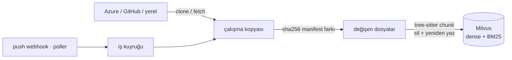
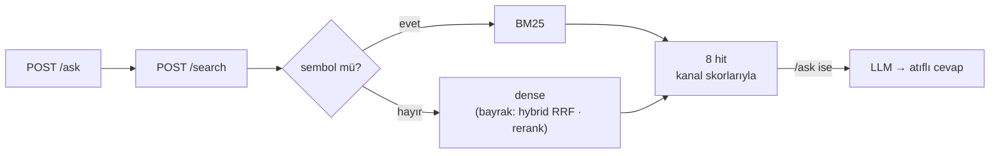

<p align="center">
  
</p>

<h1 align="center">Milvus RAG</h1>

<p align="center"><em>Kod tabanını anlayan, push'ta kendini tazeleyen arama servisi.</em></p>

<p align="center">
  <a href="README.md">English</a> · <strong>Türkçe</strong>
</p>

<p align="center">
  <a href="#neden-bu-yığın">Neden bu yığın</a> ·
  <a href="#kurulum">Kurulum</a> ·
  <a href="#kullanım">Kullanım</a> ·
  <a href="#repo-değişince-ne-olur">Tazeleme akışı</a> ·
  <a href="#retrieval-zinciri-ve-bayraklar">Retrieval</a> ·
  <a href="#ölçüm-defteri">Ölçüm defteri</a> ·
  <a href="DEPLOYMENT.md">Sunucuya kurulum</a>
</p>

<p align="center">
  <a href="https://fport.github.io/milvus-rag/tr/"><strong>Dokümantasyon — ne yapıldı, neden</strong></a> ·
  <a href="https://fport.github.io/milvus-rag/tr/rag/">RAG merdiveni</a>
</p>

---

Azure DevOps'tan ya da GitHub'dan bir repo seçersin; servis
onu klonlar, tree-sitter ile kod birimlerine böler, BGE-M3 (dense) + BM25 (sparse)
ile Milvus'a yazar; sorguda sembol biçimli sorgular BM25'e, düz cümleler dense'e gider
(hybrid RRF ve cross-encoder rerank bayrakla açılır — ikisi de ölçüldü, tabloya bak).
Repoya push geldiğinde yalnızca değişen dosyalar yeniden indexlenir.





## Neden bu yığın

Kod tabanı için RAG'ın zor kısmı vektör aramak değil. Zor olan dört şey: **sembolü tam
bulmak**, **Türkçe soruyu İngilizce koda bağlamak**, **repo değişince bayat kalmamak** ve
**cevap yokken "yok" diyebilmek**. Her parça bu dört soruya göre seçildi; ölçülebilen her
karar aşağıda "ölçüldü" diye işaretli ve rakamı [Ölçüm defteri](#ölçüm-defteri)'nde.

| Parça | Ne işe yarıyor | Neden bu | Alternatifler — neden değil |
|---|---|---|---|
| **Milvus 2.6** (Docker) | Vektör deposu: dense + BM25 sparse aynı collection'da, `repo_id` partition key | BM25'i Milvus'un kendi `Function`'ı üretir → ayrı leksik index kodu yok; partition key ile repo filtresi ucuz; range search var | **pgvector**: BM25 yok, hybrid için tsvector ayrı yol · **Qdrant**: sparse alanı var ama BM25 hesabı istemcide · **Chroma / FAISS**: tek süreç, filtre ve ölçek zayıf · **Elasticsearch**: hybrid iyi ama ayrı dünya, ağır |
| **BGE-M3** (yerel, 1024d) | Düz cümleyi vektöre çevirir; Türkçe soru ile İngilizce kod aynı uzayda | Çok dilli: TR düz cümlede R@8 0.684 — MiniLM'de 0.04'tü (ölçüldü); kod makineden çıkmaz; 8192 token pencere | **OpenAI text-embedding-3**: iyi ama kod dışarı gider, ücret (`RAG_EMBEDDING_BACKEND=openai` ile açılır) · **MiniLM**: Türkçede çöktü (ölçüldü) · **Voyage-code**: API, aynı sebep |
| **BM25** (Milvus sparse) | `handleAuthCallback`, `QUEUE_NAMES` gibi sembolleri tam bulur | Embedding sembolde kördür; BM25 sembollerde 1.0 / 1.0 (ölçüldü) | **Yalnız dense**: sembolde MRR 0.875 · **grep**: canlı ama anlam/sıralama yok — o zaten ajanın kendi aracı |
| **Sorgu yönlendirme** (regex) | Sembol biçimli sorgu → BM25, düz cümle → dense | Bedava MRR: 0.678 → 0.690; hybrid'i hep açmak bulamayan kanalı da terfi ettiriyor (MRR 0.604) (ölçüldü) | **Her zaman hybrid RRF**: daha kötü (ölçüldü) · **LLM router**: gecikme + maliyet, bir regex yetiyor |
| **RRF** (bayrak) | dense + BM25 listelerini *sırayla* birleştirir | cosine (0–1) ile BM25 (0–30) toplanamaz; RRF skora değil sıraya bakar | **Ağırlıklı toplam / Milvus WeightedRanker**: normalize etsen de korpusa göre kayar |
| **Cross-encoder rerank** bge-reranker-v2-m3 (bayrak, kapalı) | 40 adayı soruyla yan yana okuyup yeniden sıralar | Ölçüldü: bu korpusta sıralamayı bozdu (MRR 0.690 → 0.514), p50 2–4 sn → kapalı. recall@40 = 0.95 boşluğu duruyor, daha iyi bir reranker tabloya satır olarak girer | **Cohere / Voyage rerank**: API; denenmedi |
| **tree-sitter** chunking | Dosyayı fonksiyon / sınıf / metod sınırından böler, sembol adını taşır; dil kapsamı elle tablo değil, pack'in 371 grammar'ı (uzantı adı = grammar adı kuralı + küçük takma ad tablosu) | Chunk = kod birimi: atıf "dosya:satır — fonksiyon" olur, embedding tek bir şeyi temsil eder | **Sabit pencere / RecursiveCharacterTextSplitter**: fonksiyonu ortadan keser · **LLM chunking**: pahalı · `.sql` tree-sitter dışı: grammar segfault veriyor (ölçüldü), satır pencereleriyle bölünür |
| **sha256 manifest** ile artımlı sync | Push gelince yalnız değişen dosya yeniden indexlenir | İçerik hash'i: rename / mod / submodule kenar durumu yok, yerel dizin de aynı yoldan; yarıda kesilen iş eksik bırakmaz | **git diff**: kenar durumları · **Tam yeniden index**: 300 dosya ≈ dakikalar |
| **Webhook + poller** | Azure "Code pushed", GitHub push (HMAC); kaçarsa poller yakalar | Push anında tazelik, poller güvenlik ağı | **Yalnız cron**: bayat pencere · **Yalnız webhook**: kaçan event kalıcı boşluk |
| **SQLite** + tek worker kuyruk | repos / files / jobs / webhook_events; repo başına tek bekleyen iş | Tek süreç, tek dosya; Postgres + Redis kurulumu istemez | **Postgres + Celery / BullMQ**: iki ek servis, burada iş yok |
| **scrub** (regex) | Index'e girmeden sır ve PII karartır | Tutucu kurallar: aynı repoda isim bazlı kural 247 yanlış pozitif verdi, bu sürüm 2 (biri gerçek) (ölçüldü) | **detect-secrets / gitleaks**: bağımlılık + aynı yanlış pozitif sorunu |
| **Üç bant** (0.45 taban · 0.55 not) | Cevap yokken "yok" der; gri bölgeyi uyarıyla döner | kNN "yakın olan yok" demez; cosine gri bölgede ayırmıyor (bulunan min 0.526 / çöp max 0.587) → sert kapı değil, sinyal + hakem ajan (CRAG'ın üç bandı) | **Tek cosine eşiği**: gerçekleri de keser · **Reranker kapısı**: %29 yanlış alarm, +550 ms (ölçüldü) · **LLM hakem**: her sorguya bir LLM çağrısı |
| **MCP** (aynı süreç, `/mcp`) | Claude Code / Cursor için `search_code` · `read_code` · `list_repos` | Aynı retriever, ek süreç yok; ajan adayları alır, gerisini okuyarak karar verir; `read_code` yalnız indexli dosyayı okur | **stdio ayrı süreç**: model iki kez yüklenir · **Yalnız HTTP**: her ajan aracı elle sarılır |
| **Golden eval** (Recall@k · MRR · abstain) | Her retrieval kararını sayıyla verir | 42 soru + 13 negatif; "sanki iyi oldu" yok, bayrak varsayılanı JSON düşmeden değişmez | **Ragas / TruLens**: LLM hakemli, yavaş ve pahalı; retrieval'ı doğrudan ölçmek yetiyor |
| **LLM katmanı** (`auto`: Claude › OpenAI › yerel Ollama) | Atıflı cevap (`/ask`); istenirse chunk'lara açıklama (`RAG_ENRICH_LANGUAGE`) | Retrieval LLM'siz çalışır, LLM yalnız cevap katmanında; anahtar yoksa yerel `qwen3.5:9b` ile sıfır kurulum (ölçüldü, Kurulum → Yerel LLM) | **Yalnız bulut**: anahtarsız denenemez · **Yalnız yerel**: kalite/hız tavanı; ikisi de bayrakla · qwen2.5 enrichment'ta Çince'ye kayıyor (ölçüldü) → alfabe kontrolü |

Çevresi: Python 3.12 + uv, FastAPI + uvicorn, typer CLI, pydantic-settings; tek `docker compose`
ile Milvus + etcd + MinIO. Dış dünyayla yalnızca HTTP konuşur, indexlediği repolara asla yazmaz.
Bu tablo özet; her satırın gerekçesi ve tuzakları [Tasarım notları](#tasarım-notları)'nda.

## Kurulum

```bash
git clone git@github.com:fport/milvus-rag.git && cd milvus-rag
uv sync                                              # Python 3.12 + bağımlılıklar (uv indirir)
docker compose -f infra/docker-compose.yml up -d     # Milvus 2.6 + etcd + MinIO
curl -f http://localhost:9091/healthz                # "OK" (ilk açılış ~60-90 sn)
docker compose -f infra/docker-compose.yml --profile ui up -d   # (isteğe bağlı) Attu, Milvus arayüzü → :8091
ollama pull qwen3.5:9b                               # yerel LLM (6.6 GB) — /ask bununla çalışır, anahtar gerekmez
cp .env.example .env                                 # aşağıdaki değerleri doldur (yerel deneme için hiçbiri şart değil)
```

Ollama kurulu değilse: macOS'ta `brew install ollama && brew services start ollama`,
Linux'ta `curl -fsSL https://ollama.com/install.sh | sh`. Model seçenekleri ve
ölçümler [Yerel LLM ile deneme](#yerel-llm-ile-deneme-varsayılan) başlığında.

`.env`'de gerekenler — yerel bir dizin + yerel LLM ile denemek için **hiçbiri gerekmez**:

| Değişken | Ne |
|---|---|
| `AZURE_DEVOPS_ORG_URL` | `https://dev.azure.com/<org>` |
| `AZURE_DEVOPS_PAT` | Personal Access Token, kapsam **Code → Read** |
| `GITHUB_TOKEN` | isteğe bağlı — public repolar tokensız çalışır; private için fine-grained PAT (Contents: Read) |
| `RAG_WEBHOOK_SECRET` | Azure Service Hook'un göndereceği paylaşılan sır |
| `ANTHROPIC_API_KEY` | isteğe bağlı — varsa `/ask` ve enrichment Claude'a geçer; yoksa yerel Ollama modeli (aşağıya bak) |

Hepsi arayüzden de girilebilir ve girilen değer `.env`'i ezer (silinince env'e dönülür):
GitHub token ve Azure org+PAT **Repolar › Repo bağla** panelinde, webhook sırrı ve Anthropic
anahtarı **Bağlan › Anahtarlar** kartında. Doğrulanır, `data/rag.db`'de saklanır, yeniden
başlatma gerekmez.

### Yerel LLM ile deneme (varsayılan)

Sağlayıcı `RAG_LLM_PROVIDER=auto`: Anthropic anahtarı varsa Claude, yoksa OpenAI anahtarı varsa
OpenAI, o da yoksa **yerel Ollama** — yani sıfır anahtarla `/ask` çalışır. Retrieval (`/search`,
MCP) LLM'e hiç bağımlı değil.

```bash
# 1. Ollama: https://ollama.com/download  (macOS: brew install ollama · Linux: curl -fsSL https://ollama.com/install.sh | sh)
ollama pull qwen3.5:9b                 # 6.6 GB; zayıf makine için qwen3.5:4b (3.4 GB) → RAG_LLM_MODEL=qwen3.5:4b
# 2. Ollama uygulaması açık olsun (ya da `ollama serve`), sonra:
#    `ollama pull` "run ollama serve" diyorsa sunucu ayakta değil: macOS'ta uygulamayı aç
#    (brew kurulumunda `brew services start ollama`), Linux'ta `sudo systemctl enable --now ollama`,
#    ya da ayrı terminalde `ollama serve`. Kontrol: curl localhost:11434 → "Ollama is running"
uv run rag add-local ~/code/my-api --name my-api
uv run rag ask "webhook olayları nasıl kuyruğa alınıyor?" -r my-api
```

Arayüzde **Bağlan › Anahtarlar** kartı Ollama'nın ayakta olup olmadığını ve modelin indirilip
indirilmediğini canlı gösterir; eksikse çalıştırılacak komutu yazar. Düşünen modellerde (qwen3.x)
düşünme kapalı gönderilir — atıflı cevapta gerekmiyor, süre 2-3 kat kısalıyor. Bağlam penceresi
`RAG_OLLAMA_NUM_CTX=16384`: Ollama'nın 4k varsayılanı 8 chunk'lık prompt'u sessizce kırpardı.

Hugging Face'ten başka bir model, vLLM / LM Studio / llama.cpp gibi **OpenAI uyumlu** bir sunucuyla:

```bash
vllm serve Qwen/Qwen3.5-9B --port 8000          # ya da LM Studio → Local Server
RAG_LLM_PROVIDER=openai RAG_OPENAI_BASE_URL=http://localhost:8000/v1 \
RAG_LLM_MODEL=Qwen/Qwen3.5-9B OPENAI_API_KEY=local uv run rag serve
```

Ölçüldü (2026-09-01, Apple M-serisi, aynı 6 chunk'lık prompt, 3 soru — TR, EN ve cevabı olmayan):

| Model | süre / cevap | Kalite | "Cevap yok" davranışı |
|---|---|---|---|
| **qwen3.5:9b, think kapalı** ✓ | 12-17 s | iyi: [1][2][4] atıflı, doğru kod parçası, düzgün Türkçe (EN soruya da Türkçe cevapladı) | doğru: "kod tabanında bu soruya cevap verebilecek bilgi yok", 2 s |
| qwen3.5:9b, think açık | 48-51 s | 3 sorunun 2'sinde **boş cevap**: düşünce 1024 token'ın hepsini yedi → kapalı gönderilir | — |
| qwen2.5:7b | 22-32 s | iyi: dosya + fonksiyon atıflı, dilini koruyor | doğru: "kod parçaları bulunmadığından cevaplayamam", 4 s |
| qwen3:1.7b, think kapalı | 11-15 s | zayıf: "implemetasyonu", "konflikt deteksiyonu" | kararsız, konu dışına kayıyor |
| claude-opus-5 | — | referans; anahtar girilince `auto` buna geçer | doğru |

Enrichment (chunk açıklaması) için yerel model kullanacaksan alfabe kontrolü var: qwen2.5 yük
altında Çince'ye kayıyor (ölçüldü), yanlış alfabe reddedilir.

İlk çalıştırmada `BAAI/bge-m3` (~2.2 GB) ve `BAAI/bge-reranker-v2-m3` (~2.2 GB)
Hugging Face'ten iner; sonrası `~/.cache/huggingface`'ten gelir. Apple M-serisinde
otomatik `mps` kullanılır.

## Kullanım

```bash
uv run rag serve   # http://localhost:8090 → web arayüzü · /docs → OpenAPI

# Azure'a göz at, repo seç
uv run rag azure projects
uv run rag azure repos Platform
uv run rag add-azure Platform backend-api         # kaydeder + klonlar + indexler
uv run rag add-azure Platform backend-api --branch develop

# GitHub'dan repo seç (public için token gerekmez)
uv run rag github repos sindresorhus
uv run rag add-github sindresorhus/p-limit
uv run rag add-github acme/backend --branch develop

# Yerel bir dizinle dene (git olması şart değil)
uv run rag add-local ~/code/my-api --name my-api

# Ara / sor / ölç
uv run rag search "webhook eventleri nasıl kuyruğa alınıyor" -r my-api
uv run rag search withSession --mode bm25
uv run rag ask "optimistic lock nasıl çalışıyor?" -r my-api
uv run rag eval evals/golden.example.jsonl -r my-api --tag v1   # şablonu kopyalayıp doldur

# Kimlikler arayüzden de kaydedilebilir: Repolar → Repo bağla panelinde GitHub token /
# Azure org+PAT gir, doğrulanır ve data/rag.db'de saklanıp env'i ezer; repoları listeden seçersin.

# Tazele
uv run rag sync my-api                            # artımlı: yalnızca değişen dosyalar
uv run rag sync my-api --force                    # tam yeniden index
uv run rag poll                                   # Azure head'lerini bir kez kontrol et
```

Aynı işlemler HTTP'den. `/` altında basit bir web arayüzü de var — üç sekme:
**Ara** (kanal skorlarıyla arama, LLM'e soru), **İşler** (her index çalışmasının
pipeline akışı: kaynak → fark → chunk → embed → Milvus, canlı ilerleme),
**Bağlan** (kopyalanabilir webhook URL'leri, poller, curl örnekleri, MCP ayarı):

<p align="center">
  
</p>

Arayüz İngilizce. Görseldeki arama bu reponun kendisine karşı çalışıyor: düz cümle → dense
kanal → `jobs.py`'deki `JobRunner`, 62 ms. **DOCUMENT** rozeti plan/tasarım metninden gelen
sonuçları koddan ayırır — buradaki sonuçlardan biri `README.tr.md`, yani İngilizce soruya
Türkçe bir başlık cevap veriyor: BGE-M3 çok dilli.

| Uç | İş |
|---|---|
| `GET /health` | Milvus, model ve Azure durumu |
| `GET /azure/projects`, `GET /azure/projects/{p}/repos` | Azure'a göz at (`registered_as` alanı kayıtlıysa dolu) |
| `GET /github/{owner}/repos` | GitHub org/kullanıcı repoları (aynı `registered_as` alanıyla) |
| `POST /repos` | kaydet + indexle — `{provider:"azure", project, repo}` · `{provider:"github", repo:"owner/repo"}` · `{provider:"local", path}` |
| `GET /repos`, `GET /repos/{id}`, `DELETE /repos/{id}` | durum (aktif iş dahil), silme |
| `POST /repos/{id}/sync` `{force?}` | iş kuyruğa alınır → 202 |
| `GET /repos/{id}/files`, `GET /repos/{id}/file?path=&start=&end=` | manifest; dosyadan satır aralığı (agent `read_file`) |
| `GET /jobs`, `GET /jobs/{id}` | iş geçmişi ve ilerleme (`stats.progress`) |
| `POST /search` | `{q, repo_ids?, k?, mode?, rerank?, candidates?, path_prefix?, lang?, category?}` |
| `POST /ask` | aynı gövde → `{answer, sources[]}` |
| `POST /webhooks/azure/push` | Azure Service Hook hedefi |
| `POST /webhooks/github/push` | GitHub webhook hedefi (HMAC-SHA256 imza doğrulanır) |

Her `/search` sonucu kanal skorlarını taşır — hangi kanalın neyi bulduğu görünür:

```json
{"path": "src/features/jira-webhook/jira-webhook.queue.ts", "symbol": "enqueueWebhookEvent",
 "start_line": 41, "end_line": 62,
 "scores": {"dense": 0.71, "bm25": 14.2, "rrf": 0.0325, "rerank": 0.93}}
```

## Repo değişince ne olur

1. **Tetik.**
   - *Azure:* Project Settings → Service Hooks → *Web Hooks* → olay **Code pushed**,
     URL `https://<host>:8090/webhooks/azure/push`, "Basic authentication password" ya da
     `X-RAG-Webhook-Secret` header'ı = `RAG_WEBHOOK_SECRET`.
   - *GitHub:* repo → Settings → Webhooks → Add webhook: URL
     `https://<host>:8090/webhooks/github/push`, content type `application/json`,
     **Secret** = `RAG_WEBHOOK_SECRET` (HMAC-SHA256 imzası doğrulanır), olay: *Just the push event*.
   - Webhook yoksa/kaçarsa poller `RAG_POLL_INTERVAL_SECONDS` aralığıyla Azure/GitHub
     branch head'ini karşılaştırır.
2. **Kuyruk.** Repo başına tek bekleyen iş: beş push gelirse bir iş çalışır, bir iş bekler.
   Aynı commit ikinci kez gelirse (Azure yeniden dener) iş açılmaz.
3. **Fark.** `git fetch` + `reset --hard origin/<branch>`, sonra her indexlenebilir dosyanın
   sha256'sı SQLite manifest ile karşılaştırılır: eklenen / değişen / silinen / aynı.
4. **Yazma.** Değişen dosya için önce o yolun chunk'ları silinir, sonra yenileri eklenir;
   silinen dosya yalnızca silinir; aynı kalan dosya embed edilmez. Manifest satırı silmeden
   önce kaldırılır, yazdıktan sonra geri konur — yarıda kesilen iş eksik bırakmaz.
5. **Cache.** İş bitince arama cache'i boşalır; eski satır numaralarını gösteren cevap kalmaz.

`RAG_*` chunk/embedding ayarı değişirse `index_version` değişir ve bir sonraki sync tam
yeniden index yapar.

## Retrieval zinciri ve bayraklar

| Bayrak | Varsayılan | Ne yapar |
|---|---|---|
| `RAG_SEARCH_MODE` | `auto` | sembol biçimli sorgu (`handleAuthCallback`, `QUEUE_NAMES`, `a.b.c`) → BM25; düz cümle → `RAG_PROSE_MODE` |
| `RAG_PROSE_MODE` | `dense` | `dense` ya da `hybrid` (dense + BM25 → RRF, `RAG_RRF_K=60`) — ölçüldü, aşağıya bak |
| `RAG_RERANK_ENABLED` | `false` | `RAG_CANDIDATES=40` aday → `bge-reranker-v2-m3` → `RAG_TOP_K=8` — ölçüldü, zarar etti |
| `RAG_CHUNK_MAX_BYTES` / `MIN` | 2000 / 200 | chunk sınırları (≈500 token tavan) |
| `RAG_ENRICH_ENABLED` | `false` | her chunk için LLM'den açıklama, `indexed_text`'e girer (cache'li) |
| `RAG_ENRICH_LANGUAGE` | `English` | açıklamaların dili — ölçülen kazanç, soruların sorulduğu dilde metin eklemekten geliyor; soru trafiğine göre ayarla |
| `RAG_MIN_DENSE_SCORE` | `0.45` | sert taban: dense skoru bunun altındaki parça hiç dönmez (`dropped` sayar); BM25'e uygulanmaz; 0 = kapalı — ölçüldü, aşağıya bak |
| `RAG_WEAK_DENSE_SCORE` | `0.55` | en iyi dense skoru bunun altındaysa yanıt `weak_match: true` taşır — **sinyal, filtre değil**; sonuçlar yine döner — ölçüldü, aşağıya bak |

Her bayrağı `POST /search` gövdesinde ve `rag eval` parametrelerinde istek başına ezebilirsin;
ablation için tasarlandı.

### Ölçüm defteri

`rag eval` her çalışmada `evals/results/<tarih>_<etiket>.json` yazar. Golden set
şablonu `evals/golden.example.jsonl`; kendi repon için kopyalayıp doldur (repo'ya
özel setler gitignore'da — iç dosya yollarını yayınlama). Aşağıdaki rakamlar örnek
bir korpus üzerinde (318 dosyalık TypeScript API monorepo'su, 42 soru: 19 EN düz,
19 TR düz, 4 sembol; etiketler repo okunarak yazıldı), k=8:

İlk ölçüm (2026-08-31, BGE-M3, chunk 200–2000B):

| Etiket | Ayar | Recall@8 | MRR | TR-prose R@8 | p50 |
|---|---|---|---|---|---|
| bm25 | yalnız BM25 | 0.405 | 0.240 | 0.263 | 2 ms |
| hybrid | dense+BM25 → RRF | 0.786 | 0.604 | 0.684 | 40 ms |
| dense | yalnız dense | 0.786 | 0.678 | 0.684 | 32 ms |
| **auto+dense** ✓ | sembol→bm25, düz→dense | **0.786** | **0.690** | 0.684 | 34 ms |
| hybrid k=40 | aday havuzu | 0.952 | — | 0.895 | 39 ms |
| hybrid+rerank | 40→8, bge-reranker-v2-m3 | 0.762 | 0.508 | 0.579 | 4389 ms |
| auto+rerank | aynı | 0.762 | 0.514 | 0.579 | 2050 ms |

Okuma: sembollerde BM25 1.0/1.0, dense 1.0/0.875 — yönlendirme MRR'ı bedavaya taşıyor.
BGE-M3 çok dilli olduğu için Türkçe sorular çalışıyor (eski MiniLM deneyinde 0.04'tü).
Recall@40 = 0.95: reranker'ın kapatabileceği +0.17'lik alan VAR ama bge-reranker-v2-m3
onu kapatmak yerine sıralamayı bozdu ve saniyeler yedi → kapalı. Daha iyi bir reranker
denenecekse tabloya yeni satır olarak girer.

**Çekimserlik (2026-09-01).** kNN araması "en yakın k" demektir, "yakın olan yok" diye bir
kavramı yoktur: retriever "Beş yıldızlı bir tatil köyüne gittiniz mi?" sorusuna da 8 parça
döndürür (en iyisi 0.366). Halüsinasyon buradan başlar. Golden'a cevabı repoda OLMAYAN 12
negatif soru eklendi (`expect: []`); `abstain` = boş sonuç ya da `weak_match` sinyali,
`false_weak` = pozitifte sinyalin yanlış yanması. Cosine gri bölgede ayırmıyor (golden top-1
dense medyan 0.636 / min 0.526; alakasız medyan 0.531 / max 0.598 — örtüşüyor). Çözüm
CRAG'ın üç bandı: **< 0.45 → atılır** (`RAG_MIN_DENSE_SCORE`, golden'ın en düşük gerçek
cevabının hayli altında, yalnız saçma kuyruğu keser), **0.45–0.55 → döner ama "zayıf
eşleşme" notuyla** (`RAG_WEAK_DENSE_SCORE`), **≥ 0.55 → normal**. Karar tüketicinin
(ajan / LLM / arayüzdeki insan); taban sadece "cevap olamaz" bandını temizler.

| Kapı | abstain (negatif) | false_weak (42 pozitif) | Recall@8 / MRR | ek gecikme |
|---|---|---|---|---|
| dense < 0.55 notu | 10/12 = 0.833 | 2/42 = 0.048 | 0.786 / 0.690 (değişmedi) | 0 |
| **taban 0.45 + not 0.55** ✓ | 11/13 = 0.846 (2'si boş döndü) | 2/42 = 0.048 | 0.786 / 0.690 (değişmedi) | 0 |
| rerank < 0.05 (bge-reranker-v2-m3, yalnız top-8) | 12/12 | 12/42 = 0.286 | — | +550 ms p50 |
| rerank < 0.5 | 12/12 | 25/42 | — | +550 ms |

Eşikler resmi değil, **bu model + bu korpus için ölçülmüş**: cosine dağılımı embedding
modeline göre kayar (aynı iş için Mistral ~0.73, Gemini ~0.46 çıkabiliyor). Model değişince
yeniden kalibre et: `rag eval` raporundaki `calibration` bloğu bulunan pozitiflerin en düşük
top-dense'ini ve negatiflerin en yükseğini verir; taban ilkinin altına, not eşiği ikisinin
arasına konur. fport-site (blog) için de bakıldı: 6 gerçek soru 0.567–0.700, ikisi de güvende.

Okuma: reranker negatifleri kusursuz yakalıyor ama gerçek cevapların p25'ine de 0.039
veriyor — her üç sorgudan birinde yanlış alarm, ajanın notu yok saymayı öğrenmesi için
yeterli; cosine notu %5 yanlış alarmla yakalıyor → o kaldı. Taban 0.45 golden'dan hiçbir
şey düşürmedi, "tatil köyü" (0.366) ve "Kafka rebalance" (0.418) sorularını sıfır sonuca
indirdi. Kaçan ikisi ("CSV export stream", "puppeteer") repoda gerçekten *benzer* kod olan
sorular (0.598 / 0.544); orada karar ajanın. Sinyalin nasıl sunulduğu: MCP bölümü ve
arayüz (zayıf eşleşme notu, DOCUMENT rozeti, "N elendi").

**Chunk ablasyonu (2026-09-01).** Soru: tree-sitter (AST) chunk'ı düz pencereye göre ne
kazandırıyor? Aynı korpus iki kez indexlendi: `ast` (mevcut chunker) ve `plain` (kod dosyaları
boş satırdan bölünen ≤ 2000 B pencereler — bugün grammar'sız uzantıların, ör. `.vue`/`.razor`,
gördüğü yol; `chunk_file`'ı `_chunk_plain`'e yönlendiren tek seferlik betik). Aynı golden,
auto+dense, k=8. Golden'daki `expect`'ler yalnız dosya yolu (sembolsüz) → bu ölçüm atıf
doğruluğunu (`path::symbol`) ödüllendirmiyor, saf retrieval'ı ölçüyor.

| Etiket | chunk | Recall@8 | MRR | EN-prose R@8 / MRR | TR-prose R@8 / MRR | sembol R@8 / MRR | abstain / false_weak |
|---|---|---|---|---|---|---|---|
| **ablation-ast** ✓ | 2761 | **0.786** | **0.690** | 0.842 / 0.744 | 0.684 / 0.570 | 1.0 / 1.0 | 0.846 / 0.048 |
| ablation-plain | 2100 | 0.762 | 0.598 | 0.895 / 0.737 | 0.632 / 0.518 | 0.75 / 0.321 | 0.923 / 0.071 |

Okuma: recall farkı 1 soru (+0.024), MRR +0.09; kazancın neredeyse tamamı sembol sorgularında
(MRR 0.32 → 1.0) ve TR düz cümlede. EN düz cümlede düz pencere eşit, hatta 1 soru önde (n=19,
gürültü). AST chunk "daha çok bulmuyor", **doğru parçayı üste koyuyor ve adını söylüyor**;
grammar'sız kalan bir dil için kayıp yıkıcı değil, sıralama + atıf kaybı. Dil desteğini
genişletirken beklenti bu ölçekte tutulmalı.

**Enrichment ölçümü (2026-09-01).** Soru: chunk başına LLM açıklaması (`RAG_ENRICH_ENABLED`,
dil bağımsız — Anthropic "contextual retrieval") ne kazandırıyor? Tam korpusta yerel modelle
~3,5 saat sürdüğü için küçük ve adil bir düzenek: golden'ın beklediği 21 dosya + rastgele 25 kod
dosyası (46 dosya / 423 chunk) **aynı korpus iki kez** indexlendi — enrichment kapalı ve açık
(Ollama `qwen3.5:9b`, açıklamalar Türkçe — bu ölçüm `RAG_ENRICH_LANGUAGE` ayarından
önce yapıldı, ayarın varsayılanı artık `English`, 21 dk, 0 ret). Aynı golden, auto+dense, k=8. Mutlak
sayılar küçük korpusta (az dikkat dağıtıcı) tam korpustan yüksek; okunacak şey iki kol arasındaki fark.

| Etiket | Recall@8 | MRR | EN-prose R@8 / MRR | TR-prose R@8 / MRR | sembol | abstain / false_weak |
|---|---|---|---|---|---|---|
| subset-plain | 0.929 | 0.839 | 0.947 / 0.866 | 0.895 / 0.778 | 1.0 / 1.0 | 0.923 / 0.119 |
| **subset-enriched** | **1.000** | **0.912** | 1.000 / 0.874 | **1.000 / 0.932** | 1.0 / 1.0 | 0.923 / **0.048** |

Okuma: kazanç tam beklenen yerde — **TR düz cümlede MRR +0.15** (0.778 → 0.932), EN'de +0.01;
recall'da 3 soru; `false_weak` yarıya indi (gerçek cevapların dense skoru yükseliyor, 0.55 notu
daha az yanlış yanıyor); negatiflerde abstain değişmedi (açıklamalar alakasız soruya güven
üretmedi). Kalibrasyon kaymadı: pozitif min top-dense / negatif max = 0.498 / 0.587 (kapalı) →
0.483 / 0.582 (açık); 0.45 tabanı ve 0.55 notu enrichment'la da geçerli. Bu, chunk ablasyonundaki
AST kazancından (MRR +0.09, çoğu sembol sorgusu) daha büyük ve dil/framework bağımsız.

Maliyet: yerel 9B ile ~11 açıklama/dk → 2.8k chunk'lık repo ilk seferde ~4 saat, sonrası
artımlı (chunk hash + model ile cache; değişmeyen chunk ikinci kez üretilmez); bulut modelle
dakikalar. Varsayılan **kapalı kalıyor**: anahtarsız kurulumda her `add-*` saatlerce Ollama
döndürürdü. Türkçe soru trafiği olan ve LLM bütçesi bulunan kurulumda `RAG_ENRICH_ENABLED=true`
(`RAG_LLM_MODEL` ile ucuz bir model) — ölçülmüş kazanç bu tabloda.

```bash
G=evals/golden.example.jsonl   # kendi setinle değiştir
uv run rag eval $G -r my-api --tag dense  --mode dense  --no-rerank
uv run rag eval $G -r my-api --tag bm25   --mode bm25   --no-rerank
uv run rag eval $G -r my-api --tag hybrid --mode hybrid --no-rerank
uv run rag eval $G -r my-api --tag rerank --mode auto   --rerank
```

## Tasarım notları

- **Neden içerik hash'i, commit diff'i değil?** Yeniden adlandırma, mod değişikliği,
  submodule, force-push gibi kenar durumları yok; yerel (git olmayan) dizinler de aynı
  yoldan geçer. Maliyet: her sync tüm dosyaları hash'ler — 5k dosyada bir saniyenin altı,
  embedding'in yanında görünmez.
- **Neden tek Milvus collection?** `repo_id` partition key; `repo_id in [...]` filtresi
  yalnızca ilgili partition'lara iner. Repo başına collection açmak çapraz-repo aramayı
  zorlaştırır ve collection sayısını sınırlar.
- **Neden sembol sorguları BM25'e gidiyor?** Önceki bir RAG denemesi aynı korpusta
  ölçtü: sembol aramasında BM25 0.80, dense 0.60, ikisinin RRF'i
  0.60 — bulamayan kanal da tam güçle terfi ediyor. Bir regex bunu bedavaya çözer.
- **Neden reranker kapalı?** Ölçüldü: bge-reranker-v2-m3 bu korpusta hem recall hem MRR
  düşürdü (özellikle Türkçe'de) ve p50'yi 2-4 sn yaptı. Açıksa 40 aday alır — 8 adayı
  yeniden sıralamak recall'a dokunamaz; Recall@40 − Recall@8 farkı reranker'ın çalışma
  alanıdır. Fark bu korpusta var (0.95 − 0.79); onu kapatan bir model bulunursa tabloya
  satır olarak girer.
- **Neden enrichment kapalı?** Deneyde İngilizce kod üstünde Türkçe soru recall@5 = 0.04
  çıktı ve LLM açıklamaları çare oldu; ama o deney İngilizce-only MiniLM iledi. BGE-M3 çok
  dilli. Önce ölç, gerekiyorsa aç.
- **tree-sitter'da iki tuzak (ölçüldü).** py-tree-sitter 0.26 + language-pack 1.15 ile
  `Node.start_point/end_point` okumak uzun süreçte segfault veriyor (aynı dosya tek başına
  geçiyor, 39. dosyada çöküyor); satır numaraları byte ofsetinden bisect ile hesaplanır.
  `tree-sitter-sql` drizzle migration dosyalarında doğrudan çöküyor; `.sql` kod sayılır ama
  paragraf/satır pencereleriyle chunk'lanır (`CODE_WITHOUT_GRAMMAR`). Dil kapsamı elle tablo
  değil: uzantı adı pack'te grammar adıysa (`.vue`, `.razor`, `.lua`, `.zig` …) o grammar kullanılır,
  adı farklı olanlar (`.ts`, `.cs`, `.kt`) pack'e karşı doğrulanan küçük bir takma ad tablosundan
  geçer; pack ≥ 1.15 grammar'ı ilk kullanımda indirdiği için Docker imajı `prefetch()` ile
  `PREFETCH_GRAMMARS` listesini gömer ve `RAG_LIVE=1 pytest tests/test_grammars_live.py` her
  grammar'ı ayrı süreçte dejenere girdiyle dener (segfault alt süreci düşürür, listeyi korur).
- **PAT güvenliği.** Token URL'ye gömülmez; git'e `-c http.extraheader=` ile geçer,
  `.git/config`'e yazılmaz, hata mesajlarında redakte edilir. İndex'e girmeden önce
  `scrub` (API anahtarı, JWT, e-posta, `X_PASSWORD=...`) çalışır.

## Geliştirme

```bash
uv run pytest -q                              # birim testleri (Milvus/model gerekmez)
RAG_LIVE=1 uv run pytest -q tests/test_milvus_live.py   # gerçek Milvus'a karşı depo testi
uv run ruff check src tests && uv run ruff format --check src tests
```

Proje düzeni ve bağlayıcı kararlar için `CLAUDE.md`.

## Bir agent'a bağlama — MCP

Servis **MCP konuşur** (streamable HTTP, uç: `/mcp`). Claude Code'a bağlamak tek satır:

```bash
claude mcp add --transport http milvus-rag http://localhost:8090/mcp
```

Cursor, VS Code ve MCP konuşan diğer istemcilere de aynı URL'i verirsin. Üç araç
gelir, hepsi salt okuma:

| Araç | İş |
|---|---|
| `search_code(query, repo?, path_prefix?, category?, k?)` | kanal skorlarıyla ilk adaylar; `category` = `code` / `doc` / `other` |
| `read_code(repo, path, start?, end?)` | bulunan dosyadan satır aralığı — ajan gerisini okuyarak karar verir; yalnızca **indexli** dosya okunur |
| `list_repos()` | hangi kod tabanları bağlı |

Retriever her sorguya bir şey döndürür, alakasız sorguya da; kapı koymak yerine
(cosine ayırmıyor, ölçüm defterine bak) ajanı hakem yapıyoruz ve ona dürüst sinyal
veriyoruz — profesyonel sistemlerin de yaptığı bu (kalibre skor ya da LLM hakem + atıf +
doğrulama). `search_code` başlığında: kaç sonucun **DOCUMENT** olduğu (plan metnindeki
kod gerçek sanılmasın), **zayıf eşleşme** notu (`RAG_WEAK_DENSE_SCORE`), reponun son index
zamanı ve durumu. `read_code` yalnızca manifest'teki dosyayı okur — uydurma yol,
`node_modules`, `.env` hepsi "indexli değil ya da yok" döner, dosya son indexten sonra
değişmişse ⚠ der, çıktı index'e giren metin gibi scrub'lanır. Sunucu talimatı da
"bulamadım" demeyi açıkça serbest bırakır ve her iddiaya `repo/dosya:satır` ister.
Aynı sinyaller `POST /search` (`weak_match`, hit başına `category`) ve `/ask`
prompt'unda da var: tek istek atan tüketici de görsün.

Uç, DNS rebinding'e karşı varsayılan olarak yalnızca localhost'tan gelen istekleri
kabul eder; başka bir adresten bağlanılacaksa host'u `RAG_MCP_ALLOWED_HOSTS`'a ekle.
Dönen kod parçaları ajana **veri** olarak işaretlenir (talimat değil).

MCP konuşmayan bir uygulama aynı işi düz HTTP ile yapar: `POST /search` ve
`GET /repos/{id}/file` (`stale` alanı ve 404 = indexli değil). Kendi MCP sunucusu olan
bir servisi bu RAG'a bağlamak için o servis tarafında tek ayar yeter:
`RAG_SERVICE_URL=http://<host>:8090`.

Sunucuya kurulum için `DEPLOYMENT.md`. Lisans: MIT.
