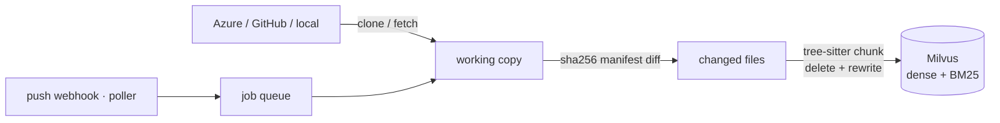
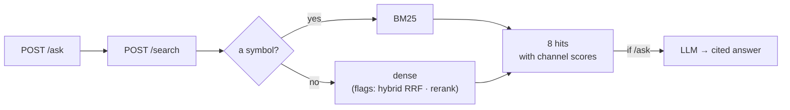

---
hide:
  - navigation
---

<div class="rag-hero" markdown>

</div>

# What this is

A search service that understands a codebase and refreshes itself on push.

You pick a repo from Azure DevOps, GitHub or a local directory. It is cloned, split into
code units with tree-sitter, and written to Milvus with BGE-M3 (dense) and BM25 (sparse).
At query time a symbol-shaped query goes to BM25 and a plain sentence goes to dense. When
a push lands, only the changed files are re-indexed.

```bash
uv run rag add-local ~/code/my-api --name my-api
uv run rag ask "how are webhook events queued?" -r my-api
```

The hard part of RAG over a codebase is not the vector search. Four things are hard, and
every decision in this project was made against them:

1. **Finding a symbol exactly.** `handleAuthCallback` is invisible to an embedding.
2. **Connecting a question in one language to code in another.**
3. **Not going stale** when the repo moves.
4. **Being able to say "no answer"** when there isn't one.

!!! measured "Nothing here ships unmeasured"

    Every retrieval decision has a number behind it, produced by `rag eval` against a
    golden set with negative cases. A flag default does not change until a JSON lands
    under `evals/results/`. "It feels better" is not a result — and two of the decisions
    below went the opposite way from what was expected.

---

## The pipeline, in five stages

<div class="grid cards" markdown>

-   **[1. Sources and sync](01-sources.md)**

    Azure / GitHub / local, a push webhook with a poller behind it, a single-worker
    queue, and change detection by content hash.

    *The trap it closes:* a git diff has edge cases for renames, mode changes and
    force-pushes. A sha256 manifest has none, and local directories take the same path.

-   **[2. Indexing](02-indexing.md)**

    tree-sitter chunking on real syntax boundaries, secret redaction before anything is
    stored, BGE-M3 embeddings, one Milvus collection with dense and BM25 side by side.

    *The trap it closes:* a fixed-size window cuts a function in half, and the embedding
    of an over-long chunk becomes an average that represents nothing.

-   **[3. Retrieval](03-retrieval.md)**

    A regex router, dense and BM25 channels, RRF behind a flag, a cross-encoder that was
    measured and turned off, and three bands for "no answer".

    *The trap it closes:* kNN has no concept of "nothing is close". It returns eight
    chunks for a question about a five-star resort too — and that is where hallucination
    starts.

-   **[4. Answers and agents](04-answers.md)**

    A cited answer layer, an LLM provider chain that ends at a local model, and an MCP
    server sharing the same retriever with the HTTP API.

    *The trap it closes:* an uncited sentence is invisible. Requiring `[n]` on every
    claim makes a fabrication something you can see.

-   **[5. Measurement](05-measurement.md)**

    A golden set with negative cases, Recall@k / MRR / abstain / false_weak, and a
    ledger where every decision is a row.

    *The trap it closes:* a threshold measured on one model and one corpus is not
    universal. The eval report prints the calibration you need to move it.

</div>

---

## The flow





---

## Sixty seconds

=== "Try it locally"

    ```bash
    uv sync
    docker compose -f infra/docker-compose.yml up -d   # Milvus + etcd + MinIO
    ollama pull qwen3.5:9b                             # optional, for /ask

    uv run rag add-local ~/code/my-api --name my-api
    uv run rag search "how are webhook events queued" -r my-api
    uv run rag ask "how does the optimistic lock work?" -r my-api
    ```

=== "Over HTTP"

    ```bash
    curl -s localhost:8090/search -H 'content-type: application/json' -d '{
      "query": "how are webhook events queued",
      "repo_ids": ["my-api"],
      "k": 8
    }' | jq '.hits[0] | {path, symbol, start_line, scores}'
    ```

    ```json
    {
      "path": "src/queue/worker.ts",
      "symbol": "enqueueWebhookEvent",
      "start_line": 42,
      "scores": {"dense": 0.71}
    }
    ```

=== "From an agent"

    ```bash
    claude mcp add --transport http milvus-rag http://localhost:8090/mcp
    ```

    Three tools: `search_code` finds candidates, `read_code` opens the rest of a file
    (only files that are indexed), `list_repos` says what is connected. The agent
    decides; the retriever's job is to offer candidates and be honest about how sure
    it is.

---

## What the numbers say

Full tables, the corpus they came from, and the caveats are in
**[Measurement](05-measurement.md)**.

| Decision | Result |
|---|---|
| Query routing (symbol → BM25) | MRR 0.678 → 0.690, free; always-hybrid is worse (0.604) |
| BGE-M3 over MiniLM | Turkish prose Recall@8 0.684 vs **0.04** |
| Cross-encoder rerank | MRR 0.690 → **0.514**, p50 2–4 s → turned off |
| tree-sitter vs plain windows | +0.024 recall, +0.09 MRR — nearly all of it on symbols and non-English prose |
| Chunk enrichment (LLM descriptions) | Turkish prose MRR 0.778 → **0.932**, `false_weak` halved |
| Three-band abstention | 0.846 abstain on negatives at a 4.8% false-alarm rate; a reranker gate cost 28.6% |
| Conservative secret scrubbing | 247 false positives → **2** on the same repo |
