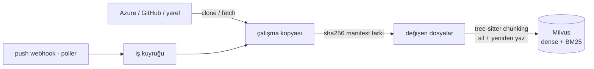
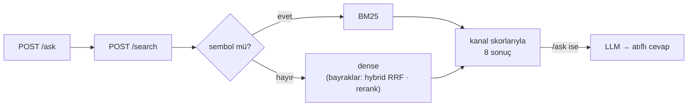

---
hide:
  - navigation
---

<div class="rag-hero" markdown>

</div>

# Bu ne

Bir kod tabanını anlayan ve her push'ta kendini tazeleyen bir arama servisi.

Azure DevOps'tan, GitHub'dan ya da yerel bir dizinden bir repo seçiyorsun. Klonlanıyor,
tree-sitter ile kod birimlerine bölünüyor, BGE-M3 (dense) ve BM25 (sparse) ile Milvus'a
yazılıyor. Sorgu anında sembol biçimli bir sorgu BM25'e, düz bir cümle dense kanala
gidiyor. Bir push düştüğünde yalnızca değişen dosyalar yeniden indeksleniyor.

```bash
uv run rag add-local ~/code/my-api --name my-api
uv run rag ask "webhook olayları nasıl kuyruğa alınıyor?" -r my-api
```

Kod tabanı üzerinde RAG'in zor kısmı vektör araması değil. Zor olan dört şey var ve bu
projedeki her karar onlara karşı verildi:

1. **Bir sembolü birebir bulmak.** `handleAuthCallback` bir embedding için görünmezdir.
2. **Bir dildeki soruyu başka bir dildeki koda bağlamak.**
3. **Repo ilerlerken bayatlamamak.**
4. **Cevap yokken "cevap yok" diyebilmek.**

!!! measured "Burada ölçülmemiş hiçbir şey yayınlanmıyor"

    Her retrieval kararının arkasında bir sayı var; negatif vakalar içeren bir golden set
    üzerinde `rag eval` ile üretildi. `evals/results/` altına bir JSON düşmeden hiçbir
    bayrak varsayılanı değişmiyor. "Daha iyi hissettiriyor" bir sonuç değil — ve aşağıdaki
    kararların ikisi beklenenin tam tersi çıktı.

!!! done "Terimler hakkında"

    Teknik terimler İngilizce bırakıldı: *retrieval*, *retriever*, *chunk*, *dense*,
    *rerank*, *embedding*, *corpus*. Türkçeleştirilmiş hâlleri ("erişimci", "yoğun
    kanal", "parçalayıcı") kimsenin konuşurken kullanmadığı, dolayısıyla okurken
    durdurup düşündüren kelimeler. Türkçe olan kısım, aralarını bağlayan metin.

!!! done "Yeniysen önce merdivene çık"

    **[RAG merdiveni](rag/index.md)** bu hikâyenin genel hâli: altı basamak, her biri bir
    alttakinde bozulan bir şeyin tamiri; en altta çalıştırılabilir bir naif RAG, en üstte
    GraphRAG. Hangi basamağın sana gerçekten lazım olduğunu söylüyor — ve 0. basamak
    "hiç RAG kurma", ki bu söylendiğinden çok daha sık doğru cevap.

---

## Hat, beş aşamada

<div class="grid cards" markdown>

-   **[1. Kaynaklar ve senkronizasyon](01-sources.md)**

    Azure / GitHub / yerel, arkasında bir poller olan push webhook'u, tek worker'lı bir
    kuyruk ve içerik özetiyle değişiklik tespiti.

    *Kapattığı tuzak:* git diff'in yeniden adlandırma, mod değişikliği ve force-push için
    uç durumları var. sha256 manifestinin hiçbiri yok — üstelik yerel dizinler de aynı
    yoldan geçiyor.

-   **[2. İndeksleme](02-indexing.md)**

    Gerçek sözdizim sınırlarında tree-sitter chunking, hiçbir şey saklanmadan önce sır
    temizliği, BGE-M3 embedding'leri, dense ve BM25'in yan yana durduğu tek bir Milvus
    koleksiyonu.

    *Kapattığı tuzak:* sabit boyutlu pencere bir fonksiyonu ortasından keser; fazla uzun
    bir chunk'ın embedding'i ise hiçbir şeyi temsil etmeyen bir ortalamaya dönüşür.

-   **[3. Retrieval](03-retrieval.md)**

    Bir regex yönlendirici, dense ve BM25 kanalları, bayrak arkasında RRF, ölçülüp
    kapatılan bir cross-encoder ve "cevap yok" için üç bant.

    *Kapattığı tuzak:* kNN'in "yakında hiçbir şey yok" diye bir kavramı yoktur. Beş
    yıldızlı bir tatil köyü sorusuna da sekiz chunk döner — halüsinasyon tam orada başlar.

-   **[4. Cevaplar ve ajanlar](04-answers.md)**

    Atıflı cevap katmanı, yerel bir modelde biten LLM sağlayıcı zinciri ve HTTP API ile
    aynı retriever'ı paylaşan bir MCP sunucusu.

    *Kapattığı tuzak:* atıfsız bir cümle görünmezdir. Her iddiaya `[n]` şartı koymak,
    uydurmayı gözle görülür bir şey hâline getirir.

-   **[5. Ölçüm](05-measurement.md)**

    Negatif vakalı bir golden set, Recall@k / MRR / abstain / false_weak ve her kararın
    bir satır olduğu bir defter.

    *Kapattığı tuzak:* tek bir model ve tek bir corpus üzerinde ölçülmüş bir eşik evrensel
    değildir. Eval raporu, o eşiği taşımak için gereken kalibrasyonu basar.

</div>

---

## Akış





---

## Altmış saniye

=== "Yerelde dene"

    ```bash
    uv sync
    docker compose -f infra/docker-compose.yml up -d   # Milvus + etcd + MinIO
    ollama pull qwen3.5:9b                             # /ask için, isteğe bağlı

    uv run rag add-local ~/code/my-api --name my-api
    uv run rag search "webhook olayları nasıl kuyruğa alınıyor" -r my-api
    uv run rag ask "iyimser kilit nasıl çalışıyor?" -r my-api
    ```

=== "HTTP üzerinden"

    ```bash
    curl -s localhost:8090/search -H 'content-type: application/json' -d '{
      "query": "webhook olayları nasıl kuyruğa alınıyor",
      "repo_ids": ["my-api"],
      "k": 8
    }' | jq '.hits[0] | {path, symbol, start_line, scores}'
    ```

    ```json
    {
      "path": "src/queue/worker.ts",
      "symbol": "enqueueWebhookEvent",
      "start_line": 42,
      "scores": {"dense": 0.71}
    }
    ```

=== "Bir ajandan"

    ```bash
    claude mcp add --transport http milvus-rag http://localhost:8090/mcp
    ```

    Üç araç: `search_code` adayları bulur, `read_code` dosyanın kalanını açar (yalnızca
    indekslenmiş dosyaları), `list_repos` nelerin bağlı olduğunu söyler. Kararı ajan
    verir; retriever'ın işi aday sunmak ve ne kadar emin olduğu konusunda dürüst olmaktır.

---

## Sayılar ne diyor

Tam tablolar, geldikleri corpus ve çekinceler **[Ölçüm](05-measurement.md)** sayfasında.

| Karar | Sonuç |
|---|---|
| Sorgu yönlendirme (sembol → BM25) | MRR 0.678 → 0.690, bedava; her zaman hybrid daha kötü (0.604) |
| MiniLM yerine BGE-M3 | Türkçe düz metin Recall@8 0.684'e karşı **0.04** |
| Cross-encoder rerank | MRR 0.690 → **0.514**, p50 2–4 sn → kapatıldı |
| tree-sitter'a karşı düz pencere | +0.024 recall, +0.09 MRR — neredeyse tamamı sembol ve İngilizce dışı metinde |
| Chunk zenginleştirme (LLM açıklamaları) | Türkçe düz metin MRR 0.778 → **0.932**, `false_weak` yarıya indi |
| Üç bantlı abstain | Negatiflerde 0.846 abstain, %4.8 yanlış alarmla; rerank kapısı %28.6'ya mal oldu |
| Muhafazakâr sır temizliği | Aynı repoda 247 yanlış pozitif → **2** |
