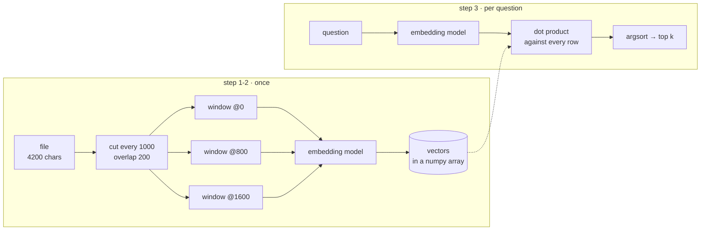

# Rung 1 — Naive RAG

Three steps, and they genuinely work:

1. cut the corpus into fixed-size windows
2. embed each window, keep the vectors
3. embed the question, return the nearest `k`



That is the whole thing. It is worth building exactly as described, once, because
every rung above it is a repair to a failure you should have watched happen.

## Run it

`examples/naive_rag.py` in this repo is that RAG in one file — 150 lines, no database,
no Milvus, vectors in a numpy array that dies with the process.

```bash
uv run python examples/naive_rag.py ~/code/my-api "how is the queue drained?"
uv run python examples/naive_rag.py ~/code/my-api --failures
```

The core is four lines:

```python
query_vector = embedder.encode_one(query)
scores = vectors @ query_vector        # unit-length rows, so a dot product IS cosine
top = np.argsort(-scores)[:k]
return [(float(scores[i]), windows[i]) for i in top]
```

Note what is not there: no filter, no floor, no second channel, no idea what a
window *is*. `argsort` returns `k` rows no matter how far away they are.

## What it is good at

Do not skip this part — rung 1 is a real tool, not a strawman.

It works well when the corpus is **prose**, in **one language**, questions are phrased
**the way the text is phrased**, and the answer sits inside a paragraph or two. Support
articles, a handbook, meeting notes, a set of blog posts. For that shape it is close to
the ceiling, and rungs 2–4 will buy you very little.

It stops working when the corpus is code, or spans languages, or the question uses
different words than the text, or the answer needs a name to be exact.

## Watch it break

`--failures` runs four questions against whatever directory you point it at. Run
against this repository, with `-k 3`:

```console
$ uv run python examples/naive_rag.py . --failures -k 3
embedding 753 windows with BAAI/bge-m3 …

iter_source_files   (an exact symbol)
  1. 0.650  src/milvus_rag/sources/__init__.py:0
     """The source layer: which files, in which language, at which commit."""
  2. 0.614  src/milvus_rag/sources/files.py:12800
     text=text,
  3. 0.597  src/milvus_rag/sources/files.py:12000
     /"))

what happens after the vectors are written?   (an answer that straddles a boundary)
  1. 0.555  src/milvus_rag/index/embed.py:0
     """Text → vector.
  2. 0.552  examples/naive_rag.py:4000
     embedder.encode_one(query)
  3. 0.552  docs/01-sources.md:4800
     build output, virtualenvs

have you ever been to a five-star resort?   (nothing in the corpus answers this)
  1. 0.700  examples/naive_rag.py:4800
     "have you ever been to a five-star resort?"),
  2. 0.558  tests/test_signals.py:2400
     ", 0.0)], 0)
  3. 0.554  tests/test_signals.py:3200
     tore(), _Embedder(), None)  # type: ignore[arg-type]
```

Four things went wrong there, and each one has a rung.

### 1. The symbol is not found

`iter_source_files` is defined at `src/milvus_rag/sources/files.py:464`. That window is
not in the results at all. What came back instead is a *docstring about sources* — text
that means something similar, which is precisely what an embedding is built to find.

An identifier is not a word. It carries no distributional meaning, and the nearest
vectors to it are other identifiers that happen to look similar. Vector search cannot
do identity. → **[Rung 3](03-hybrid.md)**

### 2. The citations are unusable

`files.py:12800` is a character offset. Nobody can act on that. And read the snippets:
`text=text,` and `/"))` are the middles of expressions, because the window boundary fell
in the middle of a function and neither half is a thing.

That is the same defect twice: a chunk with no identity produces a citation with no
identity. → **[Rung 2](02-chunking.md)**

### 3. It answers a question it cannot answer

The last block is the important one. Ranks 2 and 3 are random slices of a test file
scoring **0.558** and **0.554** — the same band the *real* answers above scored in. If
those three chunks were handed to an LLM with "answer from the context", it would write
something about a five-star resort using code from `test_signals.py`.

kNN means "the nearest k". There is no such thing as "nothing is near". → **[Rung 5](05-honesty.md)**

!!! done "Read the top hit again"

    Rank 1 at **0.700** is `examples/naive_rag.py` — the file that contains the question
    as a string literal. The best-scoring result in the whole demonstration is the demo
    quoting itself.

    That is not a bug in the example, it is rung 1's actual behaviour: a lexical
    coincidence outscored every semantic match on the page. Left in on purpose.

### 4. Nothing else about it is production-shaped

The index lives in memory. Change one file and you re-embed all 753 windows. There is no
way to search one repository and not another, no way to know how old the index is, no
way to delete anything.

None of that is a *retrieval* problem, which is why it is not a rung of its own — but it
is most of the work of turning rung 1 into a service.
→ **[Sources and sync](../01-sources.md)**.

## Before you climb

Three things about rung 1 are worth keeping as you go up:

- **The embedding model matters more than the pipeline.** Swapping MiniLM for BGE-M3
  moved non-English recall from 0.04 to 0.684 here. No amount of chunking strategy
  recovers a model that does not speak the question's language.
- **Normalize in one place.** Unit vectors searched with a dot product, or unnormalized
  ones with cosine, produce orderings that look plausible and are subtly wrong, and
  nothing errors.
- **Write the eval set now**, while the system is simple enough that you can see why
  each answer is right or wrong. → **[the handrail](index.md#the-handrail)**
