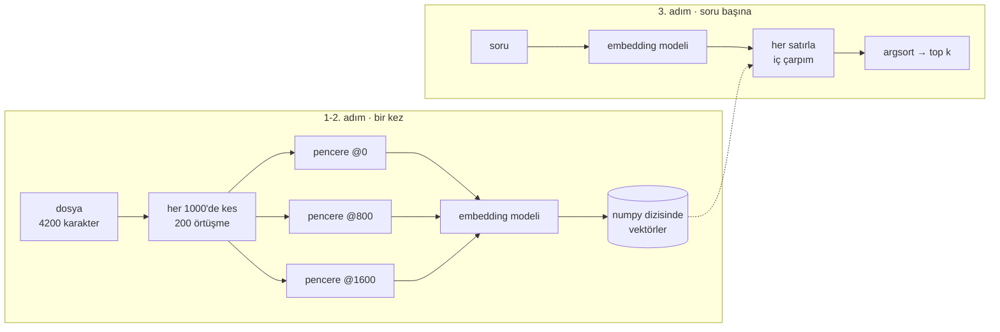

# 1. basamak — Naif RAG

Üç adım, ve gerçekten çalışıyorlar:

1. corpus'u sabit boyutlu pencerelere kes
2. her pencereyi embed'le, vektörleri sakla
3. soruyu embed'le, en yakın `k` taneyi döndür



Hepsi bu. Tam olarak tarif edildiği gibi bir kez kurmaya değer, çünkü üstündeki her
basamak, olurken izlemen gereken bir arızanın tamiri.

## Çalıştır

Bu repodaki `examples/naive_rag.py` o RAG'in tek dosyalık hâli — 150 satır, veritabanı
yok, Milvus yok, süreçle birlikte ölen bir numpy dizisinde vektörler.

```bash
uv run python examples/naive_rag.py ~/code/my-api "kuyruk nasıl boşaltılıyor?"
uv run python examples/naive_rag.py ~/code/my-api --failures
```

Çekirdeği dört satır:

```python
query_vector = embedder.encode_one(query)
scores = vectors @ query_vector        # satırlar birim uzunlukta, yani iç çarpım = kosinüs
top = np.argsort(-scores)[:k]
return [(float(scores[i]), windows[i]) for i in top]
```

Orada olmayanlara dikkat: filtre yok, taban yok, ikinci kanal yok, bir pencerenin *ne
olduğuna* dair hiçbir fikir yok. `argsort`, ne kadar uzakta olurlarsa olsunlar `k` satır
döndürüyor.

## Neyi iyi yapıyor

Bu kısmı atlama — 1. basamak bir korkuluk değil, gerçek bir araç.

Corpus **düzyazı** olduğunda, **tek bir dilde** olduğunda, sorular metnin yazıldığı
**biçimde** soruluyor olduğunda ve cevap bir iki paragrafın içinde durduğunda iyi
çalışıyor. Destek makaleleri, bir el kitabı, toplantı notları, bir blog yazısı kümesi. O
biçim için tavana yakın ve 2–4 basamakları sana çok az şey kazandırır.

Corpus kod olduğunda, dilleri aştığında, soru metinden farklı kelimeler kullandığında ya
da cevabın doğru olması için bir isme ihtiyaç duyduğunda çalışmayı bırakıyor.

## Kırıldığını izle

`--failures`, gösterdiğin dizine karşı dört soru koşuyor. Bu depoya karşı, `-k 3` ile:

```console
$ uv run python examples/naive_rag.py . --failures -k 3
embedding 753 windows with BAAI/bge-m3 …

iter_source_files   (an exact symbol)
  1. 0.650  src/milvus_rag/sources/__init__.py:0
     """The source layer: which files, in which language, at which commit."""
  2. 0.614  src/milvus_rag/sources/files.py:12800
     text=text,
  3. 0.597  src/milvus_rag/sources/files.py:12000
     /"))

what happens after the vectors are written?   (an answer that straddles a boundary)
  1. 0.555  src/milvus_rag/index/embed.py:0
     """Text → vector.
  2. 0.552  examples/naive_rag.py:4000
     embedder.encode_one(query)
  3. 0.552  docs/01-sources.md:4800
     build output, virtualenvs

have you ever been to a five-star resort?   (nothing in the corpus answers this)
  1. 0.700  examples/naive_rag.py:4800
     "have you ever been to a five-star resort?"),
  2. 0.558  tests/test_signals.py:2400
     ", 0.0)], 0)
  3. 0.554  tests/test_signals.py:3200
     tore(), _Embedder(), None)  # type: ignore[arg-type]
```

Orada dört şey ters gitti ve her birinin bir basamağı var.

### 1. Sembol bulunamıyor

`iter_source_files`, `src/milvus_rag/sources/files.py:464`'te tanımlı. O pencere
sonuçlarda hiç yok. Onun yerine gelen şey *kaynaklar hakkında bir docstring* — benzer bir
şey ifade eden metin, ki bir embedding'in bulmak için yapıldığı şey tam olarak bu.

Bir tanımlayıcı kelime değildir. Dağılımsal bir anlam taşımaz ve ona en yakın vektörler
yalnızca benzer görünen başka tanımlayıcılardır. Vektör araması birebir eşleşme yapamaz.
→ **[3. basamak](03-hybrid.md)**

### 2. Atıflar kullanılamaz

`files.py:12800` bir karakter konumu. Kimse onunla bir şey yapamaz. Bir de chunk'lara bak:
`text=text,` ve `/"))` ifadelerin ortası, çünkü pencere sınırı bir fonksiyonun ortasına
düştü ve iki yarısı da bir şey değil.

Bu aynı kusurun iki kez görünmesi: kimliği olmayan bir chunk, kimliği olmayan bir atıf
üretiyor. → **[2. basamak](02-chunking.md)**

### 3. Cevaplayamayacağı soruyu cevaplıyor

Asıl önemli olan son blok. 2. ve 3. sıralar bir test dosyasından rastgele dilimler ve
skorları **0.558** ile **0.554** — yukarıdaki *gerçek* cevapların bulunduğu bandın aynısı.
O üç chunk bir LLM'e "bağlamdan cevapla" diye verilseydi, `test_signals.py`'deki kodu
kullanarak beş yıldızlı bir tatil köyü hakkında bir şeyler yazardı.

kNN "en yakın k" demektir. "Yakında hiçbir şey yok" diye bir şey yoktur.
→ **[5. basamak](05-honesty.md)**

!!! done "En üstteki sonuca bir daha bak"

    **0.700** ile 1. sıradaki `examples/naive_rag.py`, soruyu string olarak içeren
    dosyanın kendisi. Tüm gösterimdeki en yüksek skorlu sonuç, demonun kendisini alıntılaması.

    Bu örnekte bir hata değil, 1. basamağın gerçek davranışı: lexical bir tesadüf,
    sayfadaki her anlamsal eşleşmeyi geçti. Bilerek bırakıldı.

### 4. Başka hiçbir yanı üretim biçiminde değil

İndeks bellekte yaşıyor. Bir dosyayı değiştir, 753 pencerenin hepsini yeniden embed'le.
Bir repoyu arayıp diğerini aramamanın yolu yok, indeksin ne kadar eski olduğunu bilmenin
yolu yok, bir şeyi silmenin yolu yok.

Bunların hiçbiri bir *retrieval* problemi değil — kendi basamağı olmamasının sebebi de bu —
ama 1. basamağı bir servise çevirme işinin çoğu bu.
→ **[Kaynaklar ve senkronizasyon](../01-sources.md)**.

## Çıkmadan önce

1. basamak hakkında yukarı çıkarken saklamaya değer üç şey:

- **Embedding modeli hattan daha çok önemli.** MiniLM'i BGE-M3 ile değiştirmek burada
  İngilizce dışı recall'u 0.04'ten 0.684'e taşıdı. Hiçbir chunking stratejisi, sorunun
  dilini konuşmayan bir modeli kurtarmaz.
- **Normalizasyonu tek yerde yap.** İç çarpımla aranan birim vektörler ya da kosinüsle
  aranan normalize edilmemiş vektörler, makul görünen ama ince biçimde yanlış sıralamalar
  üretir — ve hiçbir yerde hata çıkmaz.
- **Eval kümesini şimdi yaz**, sistem hâlâ her cevabın neden doğru ya da yanlış olduğunu
  görebileceğin kadar basitken. → **[eval kümesi](index.md#eval-kumesi)**
