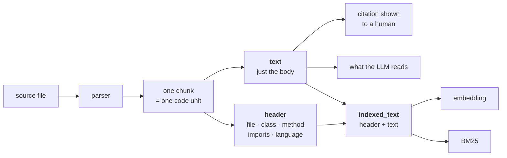

# Rung 2 — Chunks that are units

Rung 1 cut the corpus every 1000 characters. The boundary was arbitrary, so half the
chunks were halves of something.

Rung 2 makes the boundary mean something, and gives each chunk a name.

## The two changes

**The boundary comes from structure, not from a character count.** For code that is a
parser; for prose it is headings, then paragraphs.

**A chunk carries what it is.** File, symbol, parent, language, kind. That metadata is
what turns a result into a citation someone can follow, and it is also extra text the
retriever can match on.

The second change is the one people skip, and it is the cheaper of the two.

## Split the text you embed from the text you show

The single most useful detail on this rung:

```python
# ChunkRecord: `text` is the clean content that goes to the LLM;
# `header` is the "what am I, where do I live" lines prepended for
# embedding and BM25.
```

Two fields, from one chunk:

| Field | Contains | Used for |
|---|---|---|
| `text` | just the code | the citation, the LLM prompt |
| `indexed_text` | `header` + `text` | the embedding, the BM25 index |

Where the header is something like:

```text
src/queue/worker.ts · class QueueWorker · method drain
imports: redis, pino
```

Fold that header into `text` and every citation you show a human starts with three
lines of metadata. Leave it out of `indexed_text` and a method called `handle` is
indistinguishable from the forty other `handle`s in the repo.



If you take one thing from this rung, take this: **embed more than you display.** It
costs nothing and it is why a chunk can be found by the name of the class it lives in.

## For code: a parser, not brace counting

```python
CODE_WITHOUT_GRAMMAR: dict[str, str] = {".sql": "sql", ".cob": "cobol", ".cbl": "cobol"}
```

tree-sitter, not a regex over `{` and `}` — a brace inside a string literal defeats
brace counting on the first file that contains one.

The four rules this project settled on:

1. A large class is split into its members; the header and fields become their own chunk.
2. Anything below `RAG_CHUNK_MIN_BYTES` is merged with a neighbour — a one-line type or
   an import block is not a retrievable unit.
3. Nothing exceeds `RAG_CHUNK_MAX_BYTES` (2000 B). BGE-M3 accepts 8192 tokens and that
   is the trap: a long chunk's embedding is an **average**, and an average represents
   nothing well. A function over the ceiling is split into line windows that keep its
   symbol name.
4. Derive the grammar from the file extension rather than maintaining a per-language
   table. `tree-sitter-language-pack` has 371 grammars; a table would mean being wrong
   about the 372nd.

Details and the language-coverage rule: **[Indexing](../02-indexing.md)**.

## For prose: much less work

You do not need a parser to climb this rung.

- **Markdown**: split on headings, keep the heading trail (`Guide › Billing › Refunds`)
  as the header. This is most of the benefit for most corpora.
- **Plain text**: paragraphs, merged up to a minimum size.
- **HTML**: the same as markdown, over `<h1>`–`<h3>`.
- **PDF**: this is where the work actually is, and it is extraction, not chunking. Get
  the layout right first; chunking a bad extraction is polishing noise.

## What it is worth

!!! measured "AST chunking against plain windows, same corpus indexed twice"

    | Chunker | chunks | Recall@8 | MRR | symbol MRR | non-English prose MRR |
    |---|---|---|---|---|---|
    | **AST** ✓ | 2761 | **0.786** | **0.690** | **1.000** | 0.570 |
    | plain windows | 2100 | 0.762 | 0.598 | 0.321 | 0.518 |

    Recall moved by one question. MRR moved by 0.09, and almost all of it is symbol
    queries: **0.321 → 1.000**.

Read that honestly: structural chunking **does not find more**. It puts the right piece
on top and knows its name. The recall column barely moves.

Which is also the correct size of expectation. If your problem is "the answer never
comes back", rung 2 is not your rung. If your problem is "it comes back at position 6
and the citation is useless", it is.

## What it does not fix

`iter_source_files` is still not found by name — a chunk with a symbol attached is
still retrieved by an embedding, and an embedding still cannot do identity.

That is **[rung 3](03-hybrid.md)**.
