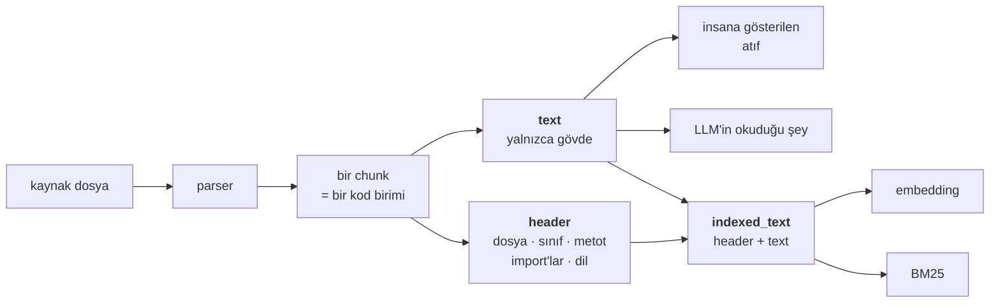

# 2. basamak — Birim olan chunk'lar

1. basamak corpus'u her 1000 karakterde bir kesti. Sınır keyfîydi, dolayısıyla chunk'ların
yarısı bir şeyin yarısıydı.

2. basamak sınırı anlamlı kılıyor ve her chunk'a bir ad veriyor.

## İki değişiklik

**Sınır karakter sayısından değil, yapıdan geliyor.** Kod için bu bir parser;
düzyazı için önce başlıklar, sonra paragraflar.

**Her chunk ne olduğunu taşıyor.** Dosya, sembol, üst öge, dil, tür. O metadata bir sonucu
takip edilebilir bir atıfa çeviren şey — ve aynı zamanda retriever'ın eşleştirebileceği
fazladan metin.

İkinci değişiklik atlananı, ve ikisinin ucuz olanı.

## Embed ettiğin metni gösterdiğinden ayır

Bu basamaktaki en işe yarar tek ayrıntı:

```python
# ChunkRecord: `text` is the clean content that goes to the LLM;
# `header` is the "what am I, where do I live" lines prepended for
# embedding and BM25.
```

Tek chunk'tan iki alan:

| Alan | İçeriği | Kullanıldığı yer |
|---|---|---|
| `text` | yalnızca kod | atıf, LLM prompt'u |
| `indexed_text` | `header` + `text` | embedding, BM25 indeksi |

Başlık şuna benzer bir şey:

```text
src/queue/worker.ts · class QueueWorker · method drain
imports: redis, pino
```

O başlığı `text`'in içine kat, insana gösterdiğin her atıf üç satır metadata ile başlasın.
`indexed_text`'ten çıkar, `handle` adlı bir metot repodaki diğer kırk `handle`'dan ayırt
edilemez olsun.



Bu basamaktan tek bir şey alacaksan şunu al: **gösterdiğinden fazlasını embed et.**
Hiçbir maliyeti yok ve bir chunk'ın, içinde yaşadığı sınıfın adıyla bulunabilmesinin
sebebi bu.

## Kod için: parser, parantez sayma değil

```python
CODE_WITHOUT_GRAMMAR: dict[str, str] = {".sql": "sql", ".cob": "cobol", ".cbl": "cobol"}
```

tree-sitter, `{` ve `}` üzerinde bir regex değil — bir string literal içindeki parantez,
onu içeren ilk dosyada parantez saymayı bozar.

Bu projenin oturduğu dört kural:

1. Büyük bir sınıf üyelerine bölünüyor; başlık ve alanlar kendi chunk'ı oluyor.
2. `RAG_CHUNK_MIN_BYTES` altındaki her şey bir komşusuyla birleşiyor — tek satırlık bir
   tip ya da bir import bloğu erişilebilir bir birim değil.
3. Hiçbir şey `RAG_CHUNK_MAX_BYTES`'ı (2000 B) aşmıyor. BGE-M3 8192 token kabul ediyor ve
   tuzak bu: uzun bir chunk'ın embedding'i bir **ortalamadır** ve ortalama hiçbir şeyi iyi
   temsil etmez. Tavanı aşan bir fonksiyon, sembol adını koruyan satır pencerelerine
   bölünüyor.
4. Grameri, dil başına bir tablo tutmak yerine dosya uzantısından türet.
   `tree-sitter-language-pack`'te 371 gramer var; tablo, 372'nci konusunda yanılmak
   demekti.

Ayrıntılar ve dil kapsamı kuralı: **[İndeksleme](../02-indexing.md)**.

## Düzyazı için: çok daha az iş

Bu basamağa çıkmak için parserya ihtiyacın yok.

- **Markdown**: başlıklardan böl, başlık izini (`Kılavuz › Faturalama › İadeler`) header
  olarak sakla. Çoğu corpus için faydanın çoğu bu.
- **Düz metin**: paragraflar, asgari boyuta kadar birleştirilmiş.
- **HTML**: `<h1>`–`<h3>` üzerinde markdown'la aynısı.
- **PDF**: asıl iş burada ve o iş chunking değil, çıkarım. Önce yerleşimi doğru al; kötü
  bir çıkarımı chunking gürültüyü cilalamaktır.

## Ne kazandırıyor

!!! measured "AST chunking'e karşı düz pencereler, aynı corpus iki kez indekslendi"

    | Chunker | chunk | Recall@8 | MRR | sembol MRR | İngilizce dışı metin MRR |
    |---|---|---|---|---|---|
    | **AST** ✓ | 2761 | **0.786** | **0.690** | **1.000** | 0.570 |
    | düz pencere | 2100 | 0.762 | 0.598 | 0.321 | 0.518 |

    Recall bir soru oynadı. MRR 0.09 oynadı ve neredeyse tamamı sembol sorguları:
    **0.321 → 1.000**.

Bunu dürüstçe oku: yapısal chunking **daha fazlasını bulmuyor**. Doğru chunk'ı en üste
koyuyor ve adını biliyor. Recall sütunu neredeyse kımıldamıyor.

Beklentinin doğru boyutu da bu. Sorunun "cevap hiç gelmiyor" ise 2. basamak senin basamağın
değil. Sorunun "6. sırada geliyor ve atıf işe yaramıyor" ise, o.

## Neyi düzeltmiyor

`iter_source_files` hâlâ adıyla bulunamıyor — sembolü iliştirilmiş bir chunk da bir
embedding ile getiriliyor ve embedding hâlâ birebir eşleşme yapamıyor.

O, **[3. basamak](03-hybrid.md)**.
