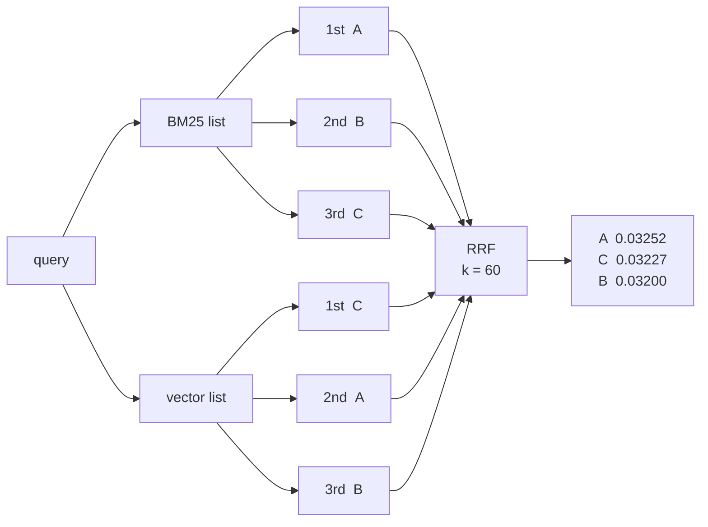
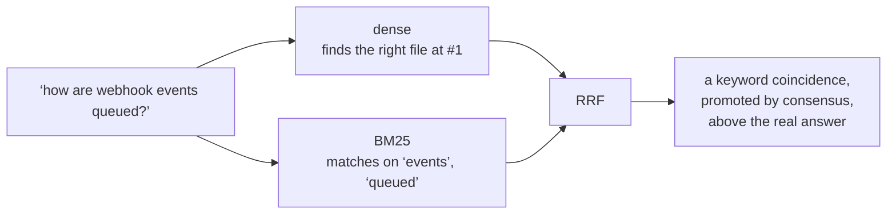

# Rung 3 — Lexical search and routing

An embedding answers "what is this about". A great many real queries are not about
anything — they are a name.

```text
handleAuthCallback        ERR_CONN_RESET        RAG_WEAK_DENSE_SCORE
UserNotFoundException     invoice_line_items    --no-verify
```

For those, similarity is the wrong question. You do not want the nearest thing, you want
*that* thing, and the standard tool for it is thirty years older than the embedding:
**BM25**, exact term matching weighted by rarity.

## Two channels

Add a lexical index next to the vector one. Every chunk goes into both.

| Channel | Good at | Blind to |
|---|---|---|
| dense (embeddings) | paraphrase, cross-language, "what is this about" | exact identity, rare tokens, misspelt-but-exact |
| BM25 (lexical) | identifiers, error codes, config keys, quoted strings | synonyms, another language, anything reworded |

In this project both live in **one Milvus collection**: nobody writes the sparse field,
Milvus' own BM25 Function derives it from `indexed_text`. That removes the usual cost of
this rung — two indexes that must be kept consistent — and is most of why Milvus is
here. If your store cannot do that, this rung means running a second index and writing
to both, transactionally-ish.

## Two scoring systems that cannot be compared

Run a query through both channels and you get two numbers for the same document:

```text
BM25    →  12.00     "search score"
vector  →   0.86     "search score"
```

The obvious move is to add them, or to weight and add them. Do not — those numbers do
not live in the same world:

| | cosine | BM25 |
|---|---|---|
| Range | −1 to 1, bounded | 0 to unbounded |
| What moves it | the angle between two vectors | term rarity, term frequency, document length |
| Depends on the corpus | no | **yes** — `idf` is computed from your corpus |
| Depends on the query | no | **yes** — a rare term inflates the whole score |

The last two rows are the killers. A BM25 score of 12.00 does not mean the same thing on
two different corpora, or even for two different queries on the *same* corpus. Any
`0.7 × cosine + 0.3 × normalized_bm25` needs a normalization constant, and that constant
drifts the moment the corpus grows.

So: **throw the scores away and keep the ranks.**

A rank has no units. "First in the BM25 list" means the same thing on every corpus, in
every language, for every query. It carries less information than the score — you lose
the gap between #1 and #2 — and that is exactly the price of comparability.

## Reciprocal Rank Fusion, worked

```text
                              1
RRF(d)  =   Σ    ─────────────────────────
           lists   k  +  rank_list(d)
```

Each list a document appears in contributes `1/(k + its rank there)`. Higher rank →
larger contributor. Sum across lists. Sort by the sum.

That is the whole algorithm. Work an example.



Step by step, for **document A**:

```text
BM25   →  rank #1  →  1 / (60 + 1)  =  0.016393
vector →  rank #2  →  1 / (60 + 2)  =  0.016129
                                       ─────────
                            RRF(A) =    0.032522
```

All three:

| Doc | BM25 rank | contributes | vector rank | contributes | RRF | final |
|---|---|---|---|---|---|---|
| **A** | #1 | 1/61 = 0.016393 | #2 | 1/62 = 0.016129 | **0.032522** | 1st |
| **C** | #3 | 1/63 = 0.015873 | #1 | 1/61 = 0.016393 | **0.032266** | 2nd |
| **B** | #2 | 1/62 = 0.016129 | #3 | 1/63 = 0.015873 | **0.032002** | 3rd |

**A > C > B.** Neither channel had that order. A wins because it is near the top of
both; C beats B because a first place in one list outweighs a second place, barely.

Notice how *close* those three numbers are — 0.0325, 0.0323, 0.0320. That is not an
accident, and it is the next thing to understand.

### What `k` actually does

`k` is a damper on how much the top of a list dominates. Look at what one document's
first-place contribution is worth relative to its fifth-place contribution:

| `k` | rank #1 | rank #5 | ratio |
|---|---|---|---|
| 0 | 1.000 | 0.200 | **5.0×** |
| 10 | 0.0909 | 0.0667 | 1.4× |
| 60 | 0.0164 | 0.0154 | **1.06×** |

At `k=0`, being first is five times better than being fifth. At `k=60` it is 6% better.

Which turns into a concrete rule about what fusion rewards. Two documents:

- **D** — #1 in BM25, and **absent** from the vector list
- **E** — #5 in *both* lists

| `k` | D (top of one list) | E (mediocre in both) | winner |
|---|---|---|---|
| 0 | 1.000 | 0.400 | **D** |
| 1 | 0.500 | 0.333 | **D** |
| 3 | 0.250 | 0.250 | tie |
| 10 | 0.0909 | 0.1333 | **E** |
| **60** | 0.0164 | **0.0308** | **E**, by 1.9× |

!!! done "The one sentence to keep"

    A large `k` makes **agreement between the channels** matter more than **being first
    in one of them**. `k = 60` is the value from the original RRF paper, and it is a
    strong preference for consensus.

That is usually what you want. Two independent retrieval methods both liking a document
is real evidence; one method loving it could be a quirk of that method.

## And it is exactly why always-fusing lost

Now the measured result reads differently.

!!! measured "Always-hybrid is worse than dense alone"

    | Mode | Recall@8 | MRR | non-English R@8 | p50 |
    |---|---|---|---|---|
    | BM25 only | 0.405 | 0.240 | 0.263 | 2 ms |
    | dense only | 0.786 | 0.678 | 0.684 | 32 ms |
    | hybrid (always RRF) | 0.786 | **0.604** | 0.684 | 40 ms |
    | **auto** (route by shape) ✓ | **0.786** | **0.690** | 0.684 | 34 ms |

    Fusing always **cost 0.074 MRR** against just using the dense channel.

RRF assumes both lists are *opinions*. For a plain-language question, BM25's list is not
an opinion — it is whatever documents happened to share a common word. But RRF cannot
tell the difference: those documents are in a list, so they get a full vote, and with
`k=60` a document sitting mid-list in the noisy channel outranks a document the good
channel put first.

Consensus weighting is a virtue when both channels are competent. It is a bug when one
of them was never going to be.



## Route instead

Decide which channel the query belongs to, and use that one.

```python
_SYMBOL_SHAPED = re.compile(r"^[A-Za-z_][\w.\-/:]*$")
_CAMEL_BOUNDARY = re.compile(r"[a-z0-9][A-Z]")

def looks_like_symbol(query: str) -> bool:
    """A single token with a boundary in it: camelCase, snake_case, kebab-case, a.b.c, a/b.

    Deliberately narrow: a false positive sends a real question to BM25 (measurably
    bad on prose); a false negative only gives up an improvement.
    """
```

That docstring is the design. The two errors are not symmetric:

- **false positive** (a real question routed to BM25) → a bad answer
- **false negative** (a symbol routed to dense) → a missed improvement

So the pattern is deliberately narrow: one token, no spaces, and an internal boundary.
Everything else is prose.

A regex, and it buys 0.012 MRR over dense-only while making symbol queries perfect
(BM25 scores 1.0/1.0 on them). An LLM router would buy the same thing for a network
call and a source of non-determinism.

!!! done "When hybrid *is* the right default"

    Routing works here because code queries fall cleanly into two shapes. On a corpus
    where they do not — mixed natural-language queries that also contain product names,
    SKUs or part numbers — there is no clean rule, and always-RRF is the honest default.

    The rung is "have both channels and use them deliberately". `RAG_PROSE_MODE=hybrid`
    turns fusion back on here; measure it on your own corpus rather than inheriting this
    table.

## What it does not fix

The retriever now finds the right thing for both query shapes. It will also, with equal
confidence, return eight chunks for a question about a five-star resort.

That is **[rung 5](05-honesty.md)**.
