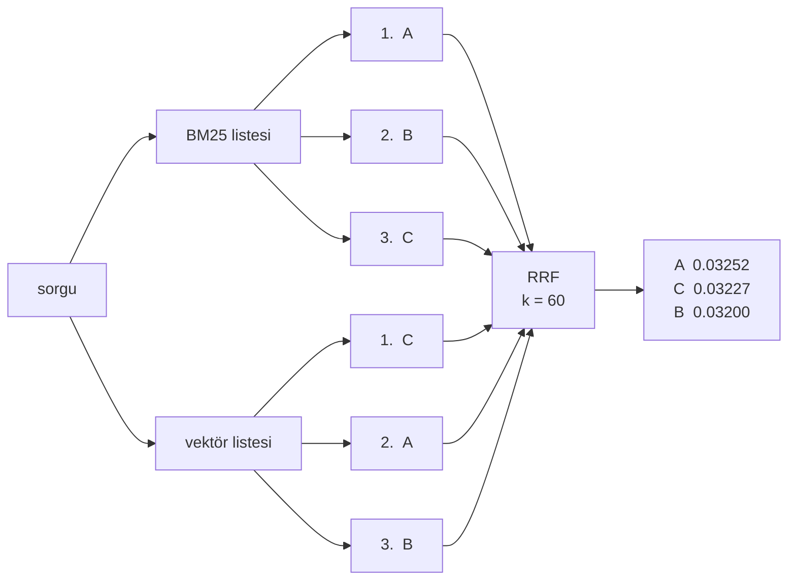
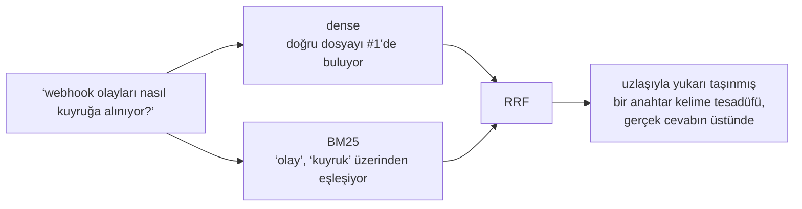

# 3. basamak — Lexical arama ve yönlendirme

Bir embedding "bu neyle ilgili" sorusunu cevaplar. Gerçek sorguların çok büyük bir kısmı
hiçbir şeyle ilgili değildir — bir isimdir.

```text
handleAuthCallback        ERR_CONN_RESET        RAG_WEAK_DENSE_SCORE
UserNotFoundException     invoice_line_items    --no-verify
```

Bunlar için benzerlik yanlış soru. En yakın şeyi değil, *o* şeyi istiyorsun ve bunun
standart aracı embedding'den otuz yıl daha eski: **BM25**, nadirliğe göre ağırlıklı
birebir terim eşleşmesi.

## İki kanal

Vektör indeksinin yanına bir lexical indeks ekle. Her chunk ikisine birden giriyor.

| Kanal | İyi olduğu şey | Kör olduğu şey |
|---|---|---|
| dense (embedding) | başka sözcüklerle ifade, diller arası, "bu neyle ilgili" | birebir eşleşme, nadir token'lar |
| BM25 (lexical) | tanımlayıcılar, hata kodları, yapılandırma anahtarları, tırnak içi metinler | eş anlamlılar, başka bir dil, yeniden ifade edilmiş her şey |

Bu projede ikisi de **tek bir Milvus koleksiyonunda**: sparse alanı kimse yazmıyor,
Milvus'un kendi BM25 Function'ı onu `indexed_text`'ten türetiyor. Bu, basamağın alışılmış
maliyetini — tutarlı tutulması gereken iki indeks — ortadan kaldırıyor ve Milvus'un burada
olmasının büyük sebebi. Kullandığın store bunu yapamıyorsa bu basamak, ikinci bir indeks çalıştırmak
ve ikisine de yazmak demek.

## Karşılaştırılamayan iki skorlama sistemi

Bir sorguyu iki kanaldan da geçir, aynı belge için iki sayı alırsın:

```text
BM25    →  12.00     "search score"
vektör  →   0.86     "search score"
```

Akla ilk gelen hamle onları toplamak ya da ağırlıklandırıp toplamak. Yapma — o sayılar
aynı dünyada yaşamıyor:

| | kosinüs | BM25 |
|---|---|---|
| Aralık | −1 ile 1 arası, sınırlı | 0'dan sınırsıza |
| Onu oynatan şey | iki vektör arasındaki açı | terim nadirliği, terim sıklığı, belge uzunluğu |
| Corpusa bağlı mı | hayır | **evet** — `idf` senin corpus'undan hesaplanıyor |
| Sorguya bağlı mı | hayır | **evet** — nadir bir terim tüm skoru şişiriyor |

Öldüren son iki satır. 12.00'lık bir BM25 skoru iki farklı corpus'ta aynı şeyi ifade
etmiyor; hatta *aynı* corpus'ta iki farklı sorgu için bile. Herhangi bir
`0.7 × kosinüs + 0.3 × normalize_bm25` bir normalizasyon sabiti gerektiriyor ve o sabit,
corpus büyüdüğü anda kayıyor.

Yani: **skorları at, sıraları tut.**

Sıranın birimi yoktur. "BM25 listesinde birinci" her corpus'ta, her dilde, her sorguda aynı
şeyi ifade eder. Skordan daha az bilgi taşır — #1 ile #2 arasındaki farkı kaybedersin — ve
karşılaştırılabilirliğin bedeli tam olarak budur.

## Reciprocal Rank Fusion, adım adım

```text
                              1
RRF(d)  =   Σ    ─────────────────────────
          listeler  k  +  rank_liste(d)
```

Bir belgenin göründüğü her liste `1/(k + oradaki sırası)` kadar katkı veriyor. Daha
yüksek sıra → daha büyük katkı. Listeler boyunca topla. Toplama göre sırala.

Algoritmanın tamamı bu. Bir örnek üzerinden gidelim.



Adım adım, **A belgesi** için:

```text
BM25   →  sıra #1  →  1 / (60 + 1)  =  0.016393
vektör →  sıra #2  →  1 / (60 + 2)  =  0.016129
                                       ─────────
                            RRF(A) =    0.032522
```

Üçü birden:

| Belge | BM25 sırası | katkısı | vektör sırası | katkısı | RRF | sonuç |
|---|---|---|---|---|---|---|
| **A** | #1 | 1/61 = 0.016393 | #2 | 1/62 = 0.016129 | **0.032522** | 1. |
| **C** | #3 | 1/63 = 0.015873 | #1 | 1/61 = 0.016393 | **0.032266** | 2. |
| **B** | #2 | 1/62 = 0.016129 | #3 | 1/63 = 0.015873 | **0.032002** | 3. |

**A > C > B.** Bu sıra iki kanalda da yoktu. A kazanıyor çünkü ikisinin de üstlerine
yakın; C ise B'yi geçiyor çünkü bir listedeki birincilik, bir ikinciliği kıl payı
aşıyor.

O üç sayının ne kadar *yakın* olduğuna dikkat et — 0.0325, 0.0323, 0.0320. Bu bir
tesadüf değil ve anlaşılması gereken bir sonraki şey.

### `k` gerçekte ne yapıyor

`k`, listenin tepesinin ne kadar baskın olacağını kısan bir katsayı. Bir belgenin
birincilik katkısının, beşincilik katkısına oranına bak:

| `k` | sıra #1 | sıra #5 | oran |
|---|---|---|---|
| 0 | 1.000 | 0.200 | **5.0×** |
| 10 | 0.0909 | 0.0667 | 1.4× |
| 60 | 0.0164 | 0.0154 | **1.06×** |

`k=0`'da birinci olmak beşinci olmaktan beş kat iyi. `k=60`'ta %6 iyi.

Bu da birleştirmenin neyi ödüllendirdiğine dair somut bir kurala dönüşüyor. İki belge:

- **D** — BM25'te #1, vektör listesinde **hiç yok**
- **E** — *her iki* listede de #5

| `k` | D (bir listenin tepesi) | E (ikisinde de vasat) | kazanan |
|---|---|---|---|
| 0 | 1.000 | 0.400 | **D** |
| 1 | 0.500 | 0.333 | **D** |
| 3 | 0.250 | 0.250 | berabere |
| 10 | 0.0909 | 0.1333 | **E** |
| **60** | 0.0164 | **0.0308** | **E**, 1.9 kat |

!!! done "Akılda tutulacak tek cümle"

    Büyük bir `k`, **kanalların hemfikir olmasını**, **birinde birinci olmaktan** daha
    önemli kılıyor. `k = 60`, orijinal RRF makalesindeki değer ve uzlaşıya kuvvetli bir
    tercih.

Genelde istediğin de bu. Birbirinden bağımsız iki retrieval yönteminin aynı belgeyi
beğenmesi gerçek bir kanıt; tek bir yöntemin ona bayılması o yöntemin bir garipliği
olabilir.

## Ve her zaman birleştirmenin kaybetme sebebi tam olarak bu

Ölçülen sonuç artık farklı okunuyor.

!!! measured "Her zaman hybrid, tek başına dense'ten daha kötü"

    | Mod | Recall@8 | MRR | İngilizce dışı R@8 | p50 |
    |---|---|---|---|---|
    | yalnızca BM25 | 0.405 | 0.240 | 0.263 | 2 ms |
    | yalnızca dense | 0.786 | 0.678 | 0.684 | 32 ms |
    | hybrid (hep RRF) | 0.786 | **0.604** | 0.684 | 40 ms |
    | **auto** (biçime göre yönlendir) ✓ | **0.786** | **0.690** | 0.684 | 34 ms |

    Her zaman birleştirmek, yalnızca dense kanalı kullanmaya karşı **0.074 MRR'a mal oldu**.

RRF, iki listenin de birer *görüş* olduğunu varsayıyor. Düz dille sorulmuş bir soruda
BM25'in listesi bir görüş değil — sadece ortak bir kelimeyi paylaşan belgeler. Ama RRF
farkı göremiyor: o belgeler bir listede, dolayısıyla tam oy alıyorlar ve `k=60` ile
gürültülü kanalın ortalarında duran bir belge, iyi kanalın birinci koyduğu belgeyi
geçiyor.

Uzlaşı ağırlıklandırması, iki kanal da yetkinken bir erdem. Biri hiçbir zaman yetkin
olmayacaksa bir hata.



## Onun yerine yönlendir

Sorgunun hangi kanala ait olduğuna karar ver ve o kanalı kullan.

```python
_SYMBOL_SHAPED = re.compile(r"^[A-Za-z_][\w.\-/:]*$")
_CAMEL_BOUNDARY = re.compile(r"[a-z0-9][A-Z]")

def looks_like_symbol(query: str) -> bool:
    """A single token with a boundary in it: camelCase, snake_case, kebab-case, a.b.c, a/b.

    Deliberately narrow: a false positive sends a real question to BM25 (measurably
    bad on prose); a false negative only gives up an improvement.
    """
```

O docstring tasarımın kendisi. İki hata simetrik değil:

- **yanlış pozitif** (gerçek bir soru BM25'e yönlendirilir) → kötü bir cevap
- **yanlış negatif** (bir sembol dense kanala yönlendirilir) → kaçırılmış bir iyileştirme

Bu yüzden desen kasıtlı olarak dar: tek token, boşluk yok, içeride bir sınır. Gerisi düz
metin.

Bir regex, ve yalnız dense kanala karşı 0.012 MRR kazandırırken sembol sorgularını kusursuz
yapıyor (BM25 onlarda 1.0/1.0 alıyor). Bir LLM yönlendirici aynı şeyi bir ağ çağrısı ve bir
belirsizlik kaynağı karşılığında verirdi.

!!! done "Hybrid'in doğru varsayılan *olduğu* yer"

    Yönlendirme burada işe yarıyor, çünkü kod sorguları temiz biçimde iki şekle ayrılıyor.
    Ayrılmadığı bir corpus'ta — içinde ürün adları, SKU'lar ya da chunk numaraları da geçen
    karışık doğal dil sorguları — temiz bir kural yok ve dürüst varsayılan her zaman RRF.

    Basamak "iki kanalı da bulundur ve bilinçli kullan". `RAG_PROSE_MODE=hybrid` burada
    birleştirmeyi geri açıyor; bu tabloyu devralmak yerine kendi corpus'unda ölç.

## Neyi düzeltmiyor

Retriever artık iki sorgu biçimi için de doğru şeyi buluyor. Aynı güvenle, beş yıldızlı bir
tatil köyü sorusuna da sekiz chunk döndürecek.

O, **[5. basamak](05-honesty.md)**.
