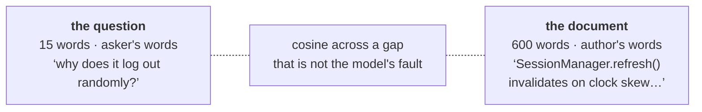
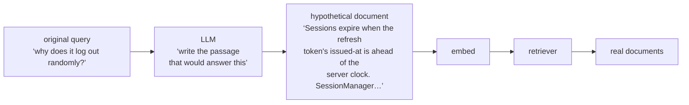
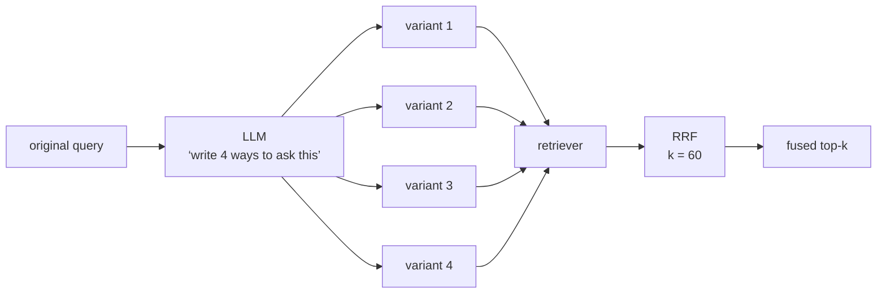
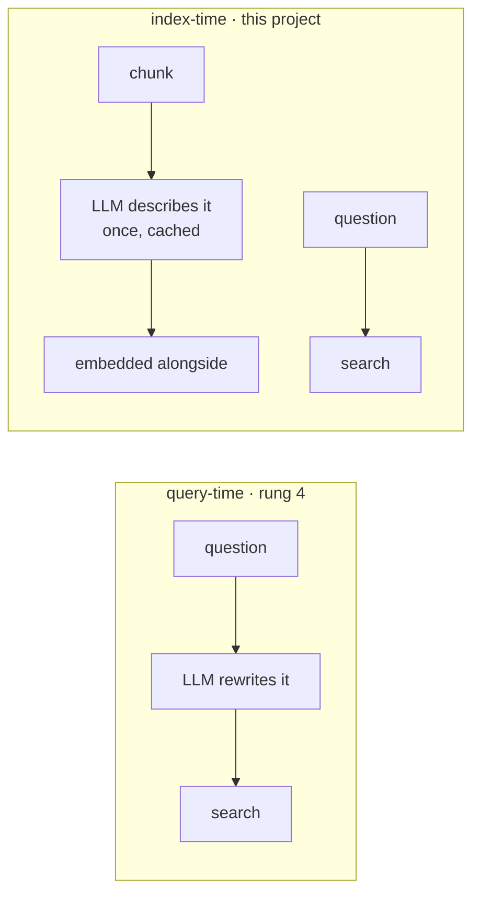

# Rung 4 — Query transformation

Every rung so far worked on the corpus. This one works on the question.

The failure it fixes is a mismatch of *shape*. A question is short, informal and written
in the asker's vocabulary. A document is long, formal and written in the author's. You
are asking an embedding model to score the similarity of two things that were never
meant to look alike.



The answer is right there in `SessionManager`, and nothing in the question resembles it.
No amount of better chunking or a second lexical channel closes that gap, because the
gap is on the query side.

So: **rewrite the query before you search with it.**

## The four transformations

They are variations on one idea — move the query closer to the shape of the answer —
and they compose.

### 1. Conversational rewriting

The cheapest and the one nobody should skip in a chat product.

```text
user:      how does the queue drain?
assistant: … QueueWorker.drain() …
user:      and what about retries?          ← the query sent to the retriever
```

`"and what about retries?"` embeds to nothing useful. The rewrite resolves it against
the history before it reaches the index:

```text
"and what about retries?"  →  "how does QueueWorker handle retries when draining the queue?"
```

If you build one thing on this rung, build this. Every follow-up question in a
conversation is broken without it, and the fix is one small model call on a short input.

### 2. HyDE — search with a fake answer

Hypothetical Document Embeddings. Instead of embedding the question, ask an LLM to
*write the answer it imagines*, and embed **that**.



```python
hyde_doc = generate(original_query, llm)      # a passage, not an answer to return
hits = retriever.invoke(hyde_doc)             # the fake document is only a search key
```

The trick is that you have converted **question ↔ document** similarity into
**document ↔ document** similarity, which is what embedding models are actually good at.
The hypothetical answer is thrown away; it is never shown to anyone.

It works even when the LLM's guess is factually wrong — the guess only has to be wrong
in the right *vocabulary*. A model that writes "session token expiry, refresh, clock
skew" has already done its job, whether or not that is why your app logs out.

**Where it fails:** a corpus the model knows nothing about. Ask about your internal
`BillingReconciler` and the model invents plausible generic billing prose, and you
retrieve generic billing code. HyDE amplifies whatever prior the model has, which is a
gain on a public-vocabulary corpus and a liability on a private one.

### 3. Step-back — ask the general question first

Some questions are too specific to match anything. Generalize, retrieve for both, and
merge.

```text
original:   "why does the optimistic lock fail on the order service under load?"
step-back:  "how is optimistic locking implemented?"
```

The step-back query finds the mechanism; the original finds the specific site. The union
usually contains both halves of the answer, and the specific query alone contained
neither.

### 4. Multi-query fan-out

Generate three or four paraphrases, search with each, and fuse the result lists.



The fuser is [RRF from rung 3](03-hybrid.md#reciprocal-rank-fusion-worked), and here it
is doing exactly the job it was designed for.

Recall why always-fusing dense with BM25 *hurt*: RRF rewards consensus, and one of those
two lists was not an opinion. Here every list comes from the same competent retriever,
asked four slightly different ways. A document that surfaces for all four phrasings is
genuinely robust; one that surfaces for a single phrasing was probably matching an
accident of wording. **Same algorithm, and this time the assumption behind it holds.**

### And a fifth, which is a different rung in disguise

**Decomposition** — splitting "which endpoints are unauthenticated?" into sub-questions
and answering each — looks like it belongs here. It does not. Once the second
sub-question depends on the answer to the first, you are not transforming a query, you
are running a loop. That is [rung 6](06-agentic.md).

## Choosing between them

| Technique | Extra LLM calls | Extra latency | Wins when | Fails when |
|---|---|---|---|---|
| Conversational rewrite | 1, tiny | ~200 ms | there is a conversation | never — always do it |
| HyDE | 1, generates a paragraph | 0.5–2 s | public vocabulary, question ≠ document phrasing | private jargon the model must invent |
| Step-back | 1, tiny | ~300 ms | the question is over-specific | the corpus is already general |
| Multi-query | 1 + **N searches** | 1 s + N × search | phrasing is unstable, recall matters more than latency | latency budget is tight |
| Routing (rung 3) | **0** | ~0 ms | queries fall into clean shapes | they do not |

Routing is on that table on purpose. It is a query transformation too — it just
*classifies* instead of rewriting, which is why it costs a regex instead of a network
call. **Try the free one first.**

## The cost nobody mentions

An LLM between the user and the search index breaks three things at once:

1. **Latency.** You added a generation before the retrieval. HyDE writing a paragraph is
   the slowest step in an otherwise 34 ms pipeline.
2. **Determinism.** The same question no longer produces the same search. Pin the
   temperature to 0 and you get *reproducible*, not *stable* — a model update changes
   every query in your system silently.
3. **Your eval.** This is the sharp one. The retrieval you measured is no longer the
   retrieval that runs. A golden set scored against raw queries says nothing about a
   system that rewrites them, so the transformation has to be **inside** the arm you
   measure, not bolted on after.

Which means the honest way to add any of this is a second column in the same table:

```bash
uv run rag eval $G -r my-api --tag baseline
uv run rag eval $G -r my-api --tag hyde --transform hyde     # same set, same k
```

## What this project does instead

`milvus-rag` has no query transformation. Two reasons, and the second is the interesting
one.

**First**, routing already handles the shape problem for code queries at zero cost, and
the corpus vocabulary is private — exactly the case where HyDE's prior is a liability
rather than an asset.

**Second, and more usefully: the same gap can be closed at index time.**



Instead of rewriting each question into the corpus's language, write a couple of
sentences of natural language *about each chunk* and embed those next to it — Anthropic's
contextual retrieval. The vocabulary gap gets closed from the other side, once, at
build time.

!!! measured "Index-time descriptions, 46 files / 423 chunks, indexed twice"

    | Arm | Recall@8 | MRR | non-English R@8 / MRR | false_weak |
    |---|---|---|---|---|
    | plain | 0.929 | 0.839 | 0.895 / 0.778 | 0.119 |
    | **enriched** | **1.000** | **0.912** | **1.000 / 0.932** | **0.048** |

    **+0.15 MRR on non-English questions** — the largest single gain measured in this
    project, and it lands precisely on the failure this rung exists for.

The trade is clean:

| | Query-time (rung 4) | Index-time (enrichment) |
|---|---|---|
| Cost | every query, forever | once per chunk, cached by hash |
| Query latency | +0.5–2 s | **0** |
| Determinism | a model in the request path | resolved before the request |
| Adapts to the question | **yes** | no — it is question-agnostic |
| Adapts to a changing corpus | automatically | re-runs on changed chunks only |
| Blocks a keyless install | no | **yes** — which is why it ships off |

Neither is strictly better. Query-time transformation reacts to what was actually asked;
index-time enrichment pays once and adds nothing to the request path. If your query
volume is high and your corpus is stable, index-time wins on arithmetic alone.

## What it does not fix

The query is now in the corpus's language and the retriever finds the right things. It
will still return eight results, confidently, for a question the corpus cannot answer at
all — and now with a hallucinated hypothetical document helping it along.

That is **[rung 5](05-honesty.md)**.
