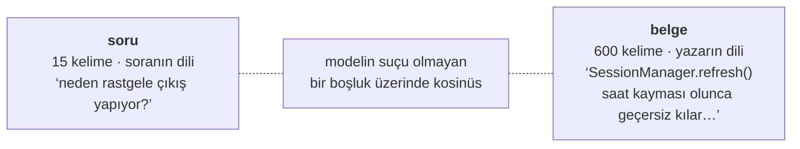
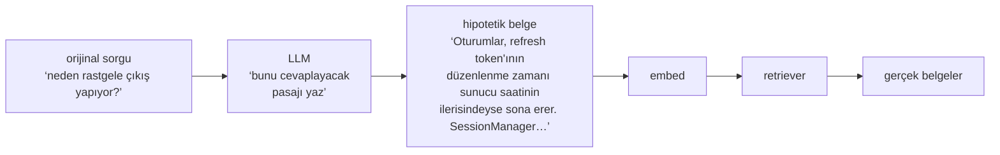
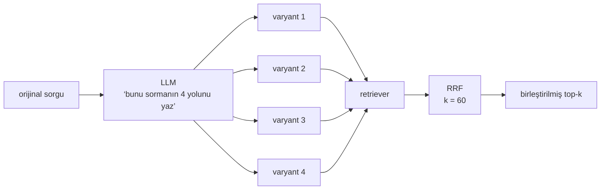
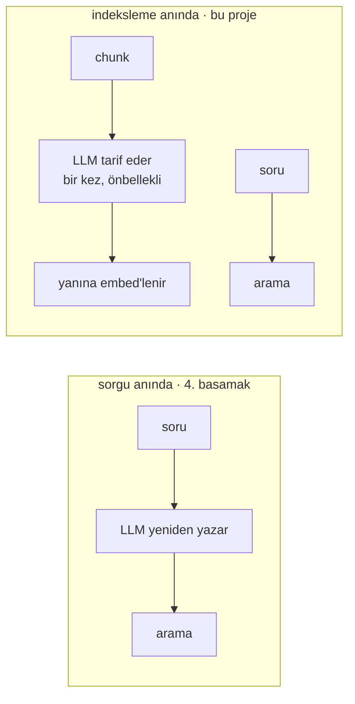

# 4. basamak — Sorgu dönüşümü

Şimdiye kadarki her basamak corpus üzerinde çalıştı. Bu basamak soru üzerinde çalışıyor.

Düzelttiği arıza bir *biçim* uyuşmazlığı. Soru kısa, gayriresmî ve soranın sözcükleriyle
yazılmış. Belge uzun, resmî ve yazarın sözcükleriyle yazılmış. Bir embedding modelinden,
birbirine benzemesi hiç amaçlanmamış iki şeyin benzerliğini puanlamasını istiyorsun.



Cevap `SessionManager`'da, tam orada — ve sorudaki hiçbir şey ona benzemiyor. Daha iyi
chunking ya da ikinci bir lexical kanal bu boşluğu kapatmıyor, çünkü boşluk sorgu
tarafında.

Yani: **aramadan önce sorguyu yeniden yaz.**

## Dört dönüşüm

Hepsi tek bir fikrin çeşitlemesi — sorguyu cevabın biçimine yaklaştır — ve birleşebiliyorlar.

### 1. Sohbet için yeniden yazma

En ucuzu ve bir sohbet ürününde kimsenin atlamaması gereken.

```text
kullanıcı: kuyruk nasıl boşaltılıyor?
asistan:   … QueueWorker.drain() …
kullanıcı: peki ya yeniden denemeler?      ← retriever'a giden sorgu
```

`"peki ya yeniden denemeler?"` işe yarar hiçbir şeye embed olmuyor. Yeniden yazma, sorgu
indekse ulaşmadan önce onu geçmişle çözüyor:

```text
"peki ya yeniden denemeler?"  →  "QueueWorker kuyruğu boşaltırken yeniden denemeleri nasıl ele alıyor?"
```

Bu basamakta tek bir şey kuracaksan bunu kur. Bir sohbetteki her takip sorusu onsuz bozuk
ve çözümü kısa bir girdi üzerinde küçük bir model çağrısı.

### 2. HyDE — sahte bir cevapla ara

Hypothetical Document Embeddings. Soruyu embed'lemek yerine bir LLM'den *hayal ettiği
cevabı yazmasını* iste ve **onu** embed'le.



```python
hyde_doc = generate(original_query, llm)      # döndürülecek bir cevap değil, bir pasaj
hits = retriever.invoke(hyde_doc)             # sahte belge yalnızca bir arama anahtarı
```

Numara şu: **soru ↔ belge** benzerliğini **belge ↔ belge** benzerliğine çevirdin ve
embedding modellerinin gerçekten iyi olduğu şey bu. Hipotetik cevap atılıyor; kimseye
gösterilmiyor.

LLM'in tahmini olgusal olarak yanlış olsa bile işe yarıyor — tahminin yalnızca doğru
*sözcüklerle* yanlış olması yeterli. "oturum token'ı süresi, yenileme, saat kayması" yazan
bir model işini çoktan yapmıştır; uygulaman gerçekten o yüzden çıkış yapıyor olsun ya da
olmasın.

**Nerede başarısız oluyor:** modelin hiç bilmediği bir corpus'ta. Kendi iç
`BillingReconciler`'ını sor, model makul görünen genel faturalama metni uydursun, sen de
genel faturalama kodu getir. HyDE modelin önyargısını büyütüyor; bu, kamuya açık
sözcüklerden oluşan bir corpus'ta kazanç, özel bir corpus'ta yük.

### 3. Step-back — önce genel soruyu sor

Bazı sorular hiçbir şeyle eşleşemeyecek kadar özel. Genelleştir, ikisi için de ara,
birleştir.

```text
orijinal:   "sipariş servisinde yük altında iyimser kilit neden başarısız oluyor?"
step-back:  "iyimser kilit nasıl uygulanmış?"
```

Step-back sorgusu mekanizmayı buluyor; orijinal sorgu özel noktayı. Birleşim genelde
cevabın iki yarısını da içeriyor — özel sorgu tek başına hiçbirini içermiyordu.

### 4. Çoklu sorgu — fan-out

Üç dört farklı ifade üret, her biriyle ara ve sonuç listelerini birleştir.



Kaynaştırıcı [3. basamaktaki RRF](03-hybrid.md#reciprocal-rank-fusion-adm-adm) ve burada
tam olarak tasarlandığı işi yapıyor.

Dense kanalla BM25'i her zaman birleştirmenin neden *zarar verdiğini* hatırla: RRF
uzlaşıyı ödüllendiriyor ve o iki listeden biri bir görüş değildi. Burada her liste aynı
yetkin retriever'dan geliyor, dört farklı biçimde sorulmuş hâlde. Dört ifadenin hepsinde
yüzeye çıkan bir belge gerçekten sağlam; yalnızca tek bir ifadede çıkan büyük ihtimalle
bir kelime tesadüfüne takılmıştı. **Aynı algoritma, ve bu sefer arkasındaki varsayım
tutuyor.**

### Ve bir beşincisi, ki kılık değiştirmiş başka bir basamak

**Ayrıştırma** — "hangi uçlar kimlik doğrulamasız?" sorusunu alt sorulara bölüp her birini
cevaplamak — buraya aitmiş gibi görünüyor. Değil. İkinci alt soru birincinin cevabına
bağımlı hâle geldiği anda bir sorguyu dönüştürmüyorsun, bir döngü çalıştırıyorsun. O,
[6. basamak](06-agentic.md).

## Aralarında seçim yapmak

| Teknik | Ek LLM çağrısı | Ek gecikme | Kazandığı yer | Battığı yer |
|---|---|---|---|---|
| Sohbet için yeniden yazma | 1, minik | ~200 ms | ortada bir sohbet varsa | asla — her zaman yap |
| HyDE | 1, bir paragraf üretir | 0.5–2 sn | kamuya açık sözcükler, soru ≠ belge ifadesi | modelin uydurması gereken özel jargon |
| Step-back | 1, minik | ~300 ms | soru fazla özel | corpus zaten genel |
| Çoklu sorgu | 1 + **N arama** | 1 sn + N × arama | ifade oynak, recall gecikmeden önemli | gecikme bütçesi dar |
| Yönlendirme (3. basamak) | **0** | ~0 ms | sorgular temiz biçimlere ayrılıyor | ayrılmıyor |

Yönlendirme o tabloda bilerek var. O da bir sorgu dönüşümü — sadece yeniden yazmak yerine
*sınıflandırıyor*, ve bir ağ çağrısı yerine bir regex'e mal olmasının sebebi bu.
**Önce bedava olanı dene.**

## Kimsenin bahsetmediği maliyet

Kullanıcı ile arama indeksi arasına giren bir LLM aynı anda üç şeyi bozuyor:

1. **Gecikme.** Retrievalin önüne bir üretim koydun. Paragraf yazan HyDE, aksi hâlde 34 ms
   olan bir hattaki en yavaş adım.
2. **Determinizm.** Aynı soru artık aynı aramayı üretmiyor. Sıcaklığı 0'a sabitle,
   *yeniden üretilebilir* olur ama *kararlı* olmaz — bir model güncellemesi sistemindeki
   her sorguyu sessizce değiştirir.
3. **Eval'in.** Sivri olan bu. Ölçtüğün retrieval, artık çalışan retrieval değil. Ham
   sorgulara karşı puanlanmış bir golden set, onları yeniden yazan bir sistem hakkında
   hiçbir şey söylemiyor; dolayısıyla dönüşümün, ölçtüğün kolun **içinde** olması
   gerekiyor, sonradan takılmış hâlde değil.

Yani bunlardan herhangi birini eklemenin dürüst yolu, aynı tabloda ikinci bir sütun:

```bash
uv run rag eval $G -r my-api --tag baseline
uv run rag eval $G -r my-api --tag hyde --transform hyde     # aynı küme, aynı k
```

## Bu proje onun yerine ne yapıyor

`milvus-rag`'de sorgu dönüşümü yok. İki sebebi var ve ilginç olan ikincisi.

**Birincisi**, yönlendirme kod sorguları için biçim problemini zaten sıfır maliyetle
çözüyor ve corpus sözcükleri özel — HyDE'nin önyargısının varlık değil yük olduğu durumun
tam kendisi.

**İkincisi, ve daha kullanışlısı: aynı boşluk indeksleme anında da kapatılabiliyor.**



Her soruyu corpus'un diline çevirmek yerine, *her chunk hakkında* birkaç cümle doğal dil
yaz ve onları chunk'ın yanına embed'le — Anthropic'in contextual retrieval'ı. Kelime farkı
diğer taraftan, bir kez, derleme zamanında kapanıyor.

!!! measured "İndeksleme anında açıklamalar, 46 dosya / 423 chunk, iki kez indekslendi"

    | Kol | Recall@8 | MRR | İngilizce dışı R@8 / MRR | false_weak |
    |---|---|---|---|---|
    | düz | 0.929 | 0.839 | 0.895 / 0.778 | 0.119 |
    | **zenginleştirilmiş** | **1.000** | **0.912** | **1.000 / 0.932** | **0.048** |

    **İngilizce dışı sorularda +0.15 MRR** — projede ölçülen tek seferlik en büyük kazanç
    ve tam olarak bu basamağın var olma sebebi olan arızaya düşüyor.

Takas temiz:

| | Sorgu anında (4. basamak) | İndeksleme anında (zenginleştirme) |
|---|---|---|
| Maliyet | her sorguda, sonsuza kadar | chunk başına bir kez, özete göre önbellekli |
| Sorgu gecikmesi | +0.5–2 sn | **0** |
| Determinizm | istek yolunda bir model | istekten önce çözülmüş |
| Soruya uyarlanıyor mu | **evet** | hayır — sorudan bağımsız |
| Değişen corpus'a uyarlanıyor mu | otomatik | yalnızca değişen chunk'larda yeniden koşuyor |
| Anahtarsız kurulumu engelliyor mu | hayır | **evet** — kapalı yayınlanmasının sebebi bu |

Hiçbiri kesin olarak daha iyi değil. Sorgu anında dönüşüm gerçekten sorulana tepki
veriyor; indeksleme anında zenginleştirme bir kez ödeyip istek yoluna hiçbir şey
eklemiyor. Sorgu hacmin yüksek ve corpus'un durağansa, indeksleme anı sırf aritmetikle
kazanıyor.

## Neyi düzeltmiyor

Sorgu artık corpus'un dilinde ve retriever doğru şeyleri buluyor. Yine de corpus'un hiç
cevaplayamayacağı bir soru için kendinden emin biçimde sekiz sonuç döndürecek — üstelik
şimdi ona yardım eden halüsinasyonlu bir hipotetik belgeyle birlikte.

O, **[5. basamak](05-honesty.md)**.
