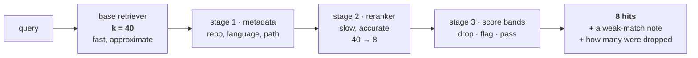

# Rung 5 — Knowing when you don't know

Every rung so far improves what comes back. This one is about what comes back when
there is nothing to come back.

A kNN search means "the nearest `k`". It has no way to express *nothing is near*. Ask a
TypeScript codebase whether you have been to a five-star resort and you get eight
chunks, ranked, with scores in the same range as real answers. Hand those to an LLM
under "answer from the context" and you have manufactured a hallucination out of an
empty result.

The retrieval layer is where that gets fixed, because it is the only layer that can see
the scores.

## First, the eval set

You cannot climb this rung by reasoning. The distributions are corpus-specific and the
intuitive answers are wrong. So before anything else:

**Twenty to forty questions, labelled by hand by reading the corpus.** Never by running
the system and accepting what it returns — that measures nothing, it just writes down
what the system already does.

```json
{"q": "where is the JWT issued?",
 "expect": ["src/auth/session.ts::createSession"],
 "mode": "any", "kind": "prose-en"}
```

Then, and this is the part specific to this rung, **negative questions**:

```json
{"q": "have you ever been to a five-star resort?", "expect": []}
```

A golden set made only of answerable questions cannot see the failure this rung exists
to fix. Ten or twelve negatives is enough.

Two numbers, and neither means anything alone:

- **`abstain_rate`** — on negatives, how often did the system say "no answer"
- **`false_weak_rate`** — on positives, how often did that same signal fire wrongly

A gate that abstains on everything scores a perfect abstain rate. Always read the pair.

The full format, metrics and runner: **[Measurement](../05-measurement.md)**.

## The shape: a filter funnel

Everything on this rung is one structure — **retrieve wide, then narrow in stages**.



The economics are the whole idea. The base retriever is cheap per document, so it can
afford to look at everything and be a little sloppy; each later stage is more expensive
per document and sees fewer of them. `k = 40` is the dial between them — too small and
the accurate stages never see the right answer, too large and you pay for accuracy on
documents that were never candidates.

!!! done "Compose the stages into one object"

    The funnel belongs behind a single retriever-shaped interface: the caller passes a
    query and gets hits, and does not know whether there are two stages or five.

    That is not tidiness. It is what keeps `k`, the reranker and the thresholds in one
    place instead of spread across every call site, and it is why a stage can be swapped
    out and the [eval](../05-measurement.md) re-run against the same questions. A funnel
    you cannot reconfigure in one line is a funnel you will never measure.

## The obvious middle stage, and what it did

The standard rung-5 upgrade is the **cross-encoder reranker** at stage 2: retrieve 40
candidates, have a model read each one next to the question, keep the best 8.

Why everyone expects it to win is worth stating precisely:

| | bi-encoder (the base retriever) | cross-encoder (the reranker) |
|---|---|---|
| How it scores | embeds query and document **separately**, then compares vectors | reads query **and** document together in one pass |
| When the document is encoded | at index time, once | at query time, every time |
| Cost | one vector lookup for the whole corpus | one forward pass **per candidate** |
| Sees word-level interaction | no | yes |

A bi-encoder has to compress a document into a single vector before it has ever seen the
query. A cross-encoder gets both at once, which is strictly more information — hence the
expectation, and hence the price: 40 candidates means 40 forward passes, in the request.

Cross-encoders reliably beat bi-encoders at ordering, and the headroom here was real —
Recall@40 is 0.95 against Recall@8 of 0.786.

!!! measured "It made the ordering worse"

    | Setting | Recall@8 | MRR | p50 |
    |---|---|---|---|
    | auto + dense | 0.786 | **0.690** | 34 ms |
    | auto + rerank (`bge-reranker-v2-m3`) | 0.762 | **0.514** | 2050 ms |

    A quarter of the MRR, and 34 ms became seconds. `RAG_RERANK_ENABLED` defaults to
    `false`.

That +0.17 of recall is still sitting in the k=40 candidate pool, unclosed. It stays on
the record as an open item rather than being quietly dropped, because it is the most
obvious place for the next improvement — and if a better reranker closes it, it enters
as a new row against the same questions instead of replacing this one.

**Do not read this as "rerankers don't work."** Read it as: rerankers are a measurement,
not a default. On another corpus with another model the row may go the other way. The
flag exists so you can find out on yours.

## Then: a threshold does not work either

The intuitive fix is a cosine floor. Look at the data first.

!!! measured "The distributions overlap"

    Real answers, best dense score: median 0.636, **min 0.526**.
    Irrelevant questions, best dense score: median 0.531, **max 0.598**.

Any single threshold either cuts real answers or admits junk. There is no number that
separates them, and that is a property of the embedding space, not a tuning failure.

## What works: bands, and a signal instead of a decision

Three bands — CRAG's shape:

| Band | Behaviour |
|---|---|
| < 0.45 | **dropped**, and counted in `dropped` |
| 0.45 – 0.55 | returned, flagged `weak_match: true` |
| ≥ 0.55 | normal |

The floor sits well below the lowest real answer in the golden set, so it only clears
the absurd tail. Everything else comes back **with a note attached**.

That is the design decision worth stealing: the retriever does not decide. It reports
what it saw — the score, the note, how many were dropped — and the consumer decides.
The consumer knows things the retriever does not: whether this is a chat UI or an
autonomous agent, whether being wrong is expensive, whether a human is watching.

!!! measured "Why the weaker detector won"

    | Gate | abstain (negatives) | false_weak (positives) | added latency |
    |---|---|---|---|
    | **floor 0.45 + note 0.55** ✓ | 0.846 | **0.048** | 0 |
    | rerank score < 0.05 | **1.000** | 0.286 | +550 ms |

    The reranker catches *every* negative — and false-alarms on one query in three.
    An agent that sees a warning it can safely ignore a third of the time learns to
    ignore it always, at which point the perfect detector detects nothing.

    A 5% false-alarm rate is a signal worth keeping. A 29% one is noise with a label on
    it.

## Recalibrate when the model changes

`0.45` and `0.55` are not constants. They were measured for **BGE-M3 on this corpus**.
The same job on Mistral's embeddings lands around 0.73, on Gemini's around 0.46.
Copying a threshold across models produces a gate that passes everything or blocks
everything.

So the eval report prints what you need to move them:

```json
"calibration": {"positive_min_top_dense": 0.498, "negative_max_top_dense": 0.587}
```

Floor below the first number, note between the two. Change the embedding model, re-run,
read the block, move the two numbers.

## What it does not fix

The system now retrieves well and admits when it cannot. It still answers every
question with exactly one lookup — and some questions need the answer to the first
lookup before you know what the second one is.

That is **[rung 6](06-agentic.md)**.
