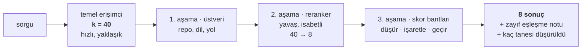

# 5. basamak — Bilmediğini bilmek

Şimdiye kadarki her basamak dönen şeyi iyileştiriyor. Bu basamak, dönecek bir şey
olmadığında ne döndüğüyle ilgili.

kNN araması "en yakın `k`" demektir. *Yakında hiçbir şey yok*'u ifade etmenin bir yolu
yoktur. Bir TypeScript kod tabanına beş yıldızlı bir tatil köyünde bulunup bulunmadığını
sor — sıralanmış sekiz parça alırsın, skorları gerçek cevaplarla aynı aralıkta. Bunları
bir LLM'e "bağlamdan cevapla" diye ver, boş bir sonuçtan halüsinasyon imal etmiş olursun.

Bunun düzeltileceği yer erişim katmanı, çünkü skorları görebilen tek katman o.

## Önce eval kümesi

Bu basamağa akıl yürüterek çıkamazsın. Dağılımlar korpusa özgü ve sezgisel cevaplar
yanlış. O yüzden her şeyden önce:

**Yirmi ilâ kırk soru, korpusu okuyarak elle etiketlenmiş.** Asla sistemi çalıştırıp
döndürdüğünü kabul ederek değil — bu hiçbir şey ölçmez, yalnızca sistemin zaten yaptığını
kayda geçirir.

```json
{"q": "where is the JWT issued?",
 "expect": ["src/auth/session.ts::createSession"],
 "mode": "any", "kind": "prose-en"}
```

Sonra — ve bu kısım tam olarak bu basamağa özgü — **negatif sorular**:

```json
{"q": "hiç beş yıldızlı bir tatil köyünde bulundun mu?", "expect": []}
```

Yalnızca cevaplanabilir sorulardan oluşan bir altın küme, bu basamağın var olma sebebi
olan arızayı göremez. On on iki negatif yeterli.

İki sayı, ve hiçbiri tek başına bir şey ifade etmiyor:

- **`abstain_rate`** — negatiflerde sistem ne sıklıkla "cevap yok" dedi
- **`false_weak_rate`** — pozitiflerde aynı sinyal ne sıklıkla yanlış tetiklendi

Her şeye çekimser kalan bir kapı kusursuz bir abstain oranı alır. Her zaman çifti oku.

Format, metrikler ve koşucu: **[Ölçüm](../05-measurement.md)**.

## Biçim: bir filtre hunisi

Bu basamaktaki her şey tek bir yapı — **geniş getir, sonra aşama aşama daralt**.



Bütün fikir ekonomide. Temel erişimci belge başına ucuz, dolayısıyla her şeye bakmayı ve
biraz özensiz olmayı göze alabiliyor; sonraki her aşama belge başına daha pahalı ve daha
azını görüyor. `k = 40` aralarındaki ayar düğmesi — fazla küçükse isabetli aşamalar doğru
cevabı hiç görmüyor, fazla büyükse hiçbir zaman aday olmayan belgeler için isabet parası
ödüyorsun.

!!! done "Aşamaları tek bir nesnede birleştir"

    Huni tek bir erişimci biçimli arayüzün arkasında durmalı: çağıran bir sorgu veriyor,
    sonuç alıyor ve iki aşama mı beş aşama mı olduğunu bilmiyor.

    Bu bir düzen takıntısı değil. `k`'yı, reranker'ı ve eşikleri her çağrı yerine
    dağıtmak yerine tek yerde tutan şey bu — ve bir aşamayı çıkarıp
    [eval'i](../05-measurement.md) aynı sorulara karşı yeniden koşabilmenin sebebi bu.
    Tek satırda yeniden yapılandıramadığın bir huni, hiçbir zaman ölçmeyeceğin bir hunidir.

## Akla ilk gelen orta aşama, ve ne yaptığı

Standart 5. basamak yükseltmesi 2. aşamadaki **cross-encoder reranker**: 40 aday getir,
bir model her birini sorunun yanında okusun, en iyi 8'i tut.

Herkesin neden kazanmasını beklediğini tam olarak söylemeye değer:

| | bi-encoder (temel erişimci) | cross-encoder (reranker) |
|---|---|---|
| Nasıl puanlıyor | sorgu ile belgeyi **ayrı ayrı** embed'leyip vektörleri karşılaştırıyor | sorgu **ve** belgeyi tek geçişte birlikte okuyor |
| Belge ne zaman kodlanıyor | indeksleme anında, bir kez | sorgu anında, her seferinde |
| Maliyet | tüm korpus için tek bir vektör araması | **aday başına** bir ileri geçiş |
| Kelime düzeyi etkileşimi görüyor mu | hayır | evet |

Bir bi-encoder, sorguyu hiç görmeden önce belgeyi tek bir vektöre sıkıştırmak zorunda. Bir
cross-encoder ikisini birden alıyor, ki bu kesinlikle daha fazla bilgi — beklentinin
sebebi bu, bedelinin sebebi de: 40 aday, istek içinde 40 ileri geçiş demek.

Cross-encoder'lar sıralamada bi-encoder'ları güvenilir biçimde yener ve buradaki pay
gerçekti — Recall@40 0.95, Recall@8 ise 0.786.

!!! measured "Sıralamayı kötüleştirdi"

    | Ayar | Recall@8 | MRR | p50 |
    |---|---|---|---|
    | auto + yoğun | 0.786 | **0.690** | 34 ms |
    | auto + rerank (`bge-reranker-v2-m3`) | 0.762 | **0.514** | 2050 ms |

    MRR'ın dörtte biri, ve 34 ms saniyelere çıktı. `RAG_RERANK_ENABLED` varsayılanı
    `false`.

O +0.17'lik recall hâlâ k=40 aday havuzunda duruyor, kapanmamış. Sessizce düşürülmek
yerine kayıtta kalıyor, çünkü bir sonraki iyileştirme için en bariz yer orası — ve daha
iyi bir reranker onu kapatırsa, bu satırın yerini almak yerine aynı sorulara karşı yeni
bir satır olarak giriyor.

**Bunu "reranker'lar işe yaramaz" diye okuma.** Şöyle oku: reranker bir varsayılan değil,
bir ölçümdür. Başka bir modelle başka bir korpusta satır ters yöne gidebilir. Bayrak,
kendi korpusunda öğrenebilesin diye orada.

## Sonra: eşik de işe yaramıyor

Sezgisel çözüm bir kosinüs tabanı. Önce veriye bak.

!!! measured "Dağılımlar örtüşüyor"

    Gerçek cevaplar, en iyi yoğun skor: medyan 0.636, **min 0.526**.
    Alakasız sorular, en iyi yoğun skor: medyan 0.531, **maks 0.598**.

Tek bir eşik ya gerçek cevapları keser ya da çöpü içeri alır. Onları ayıran bir sayı yok
ve bu embedding uzayının bir özelliği, bir ayar başarısızlığı değil.

## İşe yarayan: bantlar, ve karar yerine sinyal

Üç bant — CRAG'in biçimi:

| Bant | Davranış |
|---|---|
| < 0.45 | **düşürülür**, `dropped` içinde sayılır |
| 0.45 – 0.55 | döner, `weak_match: true` işaretiyle |
| ≥ 0.55 | normal |

Taban altın kümedeki en düşük gerçek cevabın epey altında, yani yalnızca saçma kuyruğu
temizliyor. Gerisi **bir notla birlikte** dönüyor.

Çalınmaya değer tasarım kararı bu: erişimci karar vermiyor. Gördüğünü bildiriyor — skoru,
notu, kaç tane düşürüldüğünü — ve kararı tüketen veriyor. Tüketen, erişimcinin bilmediği
şeyleri biliyor: bunun bir sohbet arayüzü mü yoksa otonom bir ajan mı olduğunu, yanılmanın
pahalı olup olmadığını, bir insanın izleyip izlemediğini.

!!! measured "Neden daha zayıf dedektör kazandı"

    | Kapı | abstain (negatifler) | false_weak (pozitifler) | eklenen gecikme |
    |---|---|---|---|
    | **taban 0.45 + not 0.55** ✓ | 0.846 | **0.048** | 0 |
    | rerank skoru < 0.05 | **1.000** | 0.286 | +550 ms |

    Reranker *her* negatifi yakalıyor — ve üç sorgudan birinde yanlış alarm veriyor.
    Üçte bir oranında güvenle görmezden gelebileceği bir uyarı gören bir ajan, onu her
    zaman görmezden gelmeyi öğrenir; o noktada kusursuz dedektör hiçbir şey tespit etmez.

    %5'lik bir yanlış alarm oranı tutulmaya değer bir sinyal. %29'luk olan, üstünde etiket
    olan gürültü.

## Model değişince yeniden kalibre et

`0.45` ve `0.55` sabit değil. **Bu korpusta BGE-M3 için** ölçüldüler. Aynı iş Mistral'ın
embedding'lerinde 0.73 civarına, Gemini'de 0.46 civarına düşüyor. Bir eşiği modeller arası
kopyalamak, her şeyi geçiren ya da her şeyi engelleyen bir kapı üretir.

Bu yüzden eval raporu onları taşımak için gerekeni basıyor:

```json
"calibration": {"positive_min_top_dense": 0.498, "negative_max_top_dense": 0.587}
```

Taban ilk sayının altına, not ikisinin arasına. Embedding modelini değiştir, yeniden koş,
bloğu oku, iki sayıyı taşı.

## Neyi düzeltmiyor

Sistem artık iyi erişiyor ve yapamadığında kabul ediyor. Yine de her soruyu tam olarak
tek bir aramayla cevaplıyor — ve bazı sorularda ikincisinin ne olduğunu bilmek için
birincinin cevabı gerekiyor.

O, **[6. basamak](06-agentic.md)**.
