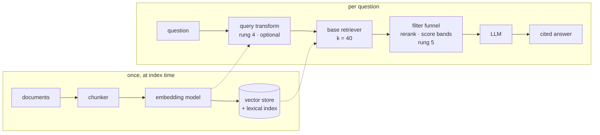

# The RAG ladder

RAG is not one architecture. It is a ladder, and every rung exists because a specific
thing broke on the rung below it.

That order matters more than it sounds. The usual failure is not building a bad RAG —
it is building rung 5 on day one, never seeing the failures that motivated rungs 2 and
3, and being unable to tell which of the seven moving parts is the one hurting you.

So: climb one rung at a time, and only when something is actually broken.

| Rung | What it adds | The failure it fixes | What it costs |
|---|---|---|---|
| **0** | [Nothing](#rung-0-dont) | — | — |
| **1** | [Windows, embeddings, top-k](01-naive.md) | you cannot fit the corpus in a prompt | an embedding model |
| **2** | [Chunks that are units](02-chunking.md) | half a function, a citation nobody can follow | a parser, per language |
| **3** | [Lexical search and routing](03-hybrid.md) | `handleAuthCallback` is invisible to a vector | a second index, or a store that has one |
| **4** | [Query transformation](04-query.md) | the question and the answer use different words | an LLM call before every search |
| **5** | [Knowing when you don't know](05-honesty.md) | confident answers to unanswerable questions | a hand-labelled eval set |
| **6** | [Agentic retrieval](06-agentic.md) | one lookup cannot answer a two-hop question | latency, tokens, non-determinism |
| **7** | [GraphRAG](07-graph.md) | "what are the main themes", "what breaks if I change this" | an extraction pass, and re-running it |

## Rung 0: don't

The first question is whether you need retrieval at all.

A modern context window holds a few hundred thousand tokens. If your corpus is a
handbook, a schema, forty markdown files or one service's `src/`, the highest-quality
retrieval available to you is **putting all of it in the prompt** — no chunk boundaries
to get wrong, no top-k to miss the answer, no ranking to tune. With prompt caching the
cost of re-sending it is small, and the accuracy ceiling is the model's, not your
retriever's.

Build rung 1 when one of these is true:

- the corpus does not fit, or fits but costs more per query than an index would
- it changes faster than you want to re-send it
- you need to *cite* — to point at the file and line an answer came from
- you need per-user or per-repo isolation inside one corpus

The reason this rung is written down is that "we need a RAG" is very often decided
before anyone checks. A 40-file corpus in the prompt beats a mediocre retriever over
the same 40 files, every time.

## The handrail

You cannot tell whether you climbed or fell without something to measure against.

Twenty to forty questions with hand-written answers — read the corpus, write down which
file actually answers each — is a couple of hours of work and it is the single highest
leverage thing on this page. Without it every rung above is a matter of opinion, and
opinion in retrieval is reliably wrong: three of this project's decisions came out the
opposite of the intuition that motivated them.

The set-up, the metrics and what to do about negative questions are on
**[Measurement](../05-measurement.md)**. Build it before rung 2, not after rung 6.

!!! measured "Three times intuition lost here"

    - A cross-encoder reranker — the standard "obviously better" upgrade — **cut MRR
      from 0.690 to 0.514** and added seconds. It ships off.
    - The same reranker as an abstention gate caught **every** negative question, and
      false-alarmed on **one positive in three**. The dumber cosine note shipped instead.
    - LLM-written chunk descriptions, the feature added last and expected to be
      marginal, produced the **largest single gain in the project** (+0.15 MRR on
      non-English questions).

## Which rung do you need?

Diagnose from the symptom, not from the architecture diagram.

| What you are seeing | Rung |
|---|---|
| The corpus is small and rarely changes | [0](#rung-0-dont) |
| Results are cut mid-function, and citations point at an offset | [2](02-chunking.md) |
| An exact identifier, error code or config key is not found | [3](03-hybrid.md) |
| The answer is in there, but the question is not phrased the way the document is written | [4](04-query.md) |
| It answers questions the corpus cannot answer | [5](05-honesty.md) |
| You changed something and cannot say whether it helped | [the handrail](../05-measurement.md) |
| The answer needs a lookup, then a second lookup based on the first | [6](06-agentic.md) |
| "What are the main themes?" / "What depends on this?" | [7](07-graph.md) |

## How it gets assembled

The rungs are an order of *problems*. The wiring is shorter than that, and above rung 1
it is the same four objects every time:

1. **Set up the embedding model.** The same model at index time and at query time,
   always. Two models means two spaces, and every cosine number after that is noise.
2. **Connect the store.** One collection, dense and lexical side by side if it supports
   that ([rung 3](03-hybrid.md)).
3. **Build the filter funnel.** A base retriever with a wide `k`, then whatever narrows
   it — reranker, score bands, metadata filters — composed into **one object** that the
   caller uses like a plain retriever. That composition is the point: it keeps `k` and
   the narrowing rules in one place instead of spread across call sites, and it is what
   lets you swap a stage out and re-run the eval. [Rung 5](05-honesty.md) is where the
   funnel's stages get chosen, and measured.
4. **Set up the LLM.** Last, and optional — everything above answers a search request
   with no model involved at all.

## Where this project sits

`milvus-rag` is rungs 1, 2, 3, 5 and 6, built in that order, with the measurements from
each step kept. Rung 4 has a page but is not in the service —
[it explains why](04-query.md), and what this project does at index time instead. Rung 7
is deliberately not built; [that page](07-graph.md) says what it would take and why the
answer for a codebase is different from the answer for prose.

The five chapters under **[The pipeline](../01-sources.md)** are the same story told
concretely: this is what those rungs look like as one running service instead of a list
of ideas.
