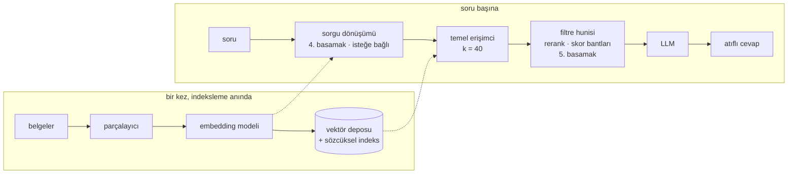

# RAG merdiveni

RAG tek bir mimari değil. Bir merdiven — ve her basamak, bir altındaki basamakta somut
bir şey bozulduğu için var.

Bu sıra kulağa geldiğinden daha önemli. Alışılmış hata kötü bir RAG kurmak değil; ilk
gün 5. basamağı kurmak, 2. ve 3. basamağı doğuran arızaları hiç görmemek ve yedi
hareketli parçadan hangisinin canını yaktığını söyleyememek.

Yani: teker teker çık, ve yalnızca gerçekten bir şey bozulduğunda.

| Basamak | Ne ekliyor | Düzelttiği arıza | Maliyeti |
|---|---|---|---|
| **0** | [Hiçbir şey](#0-basamak-yapma) | — | — |
| **1** | [Pencereler, embedding, top-k](01-naive.md) | korpus prompt'a sığmıyor | bir embedding modeli |
| **2** | [Birim olan parçalar](02-chunking.md) | yarım fonksiyon, takip edilemeyen atıf | dil başına bir ayrıştırıcı |
| **3** | [Sözcüksel arama ve yönlendirme](03-hybrid.md) | `handleAuthCallback` bir vektöre görünmez | ikinci bir indeks, ya da onu içeren bir depo |
| **4** | [Sorgu dönüşümü](04-query.md) | soru ile cevap farklı kelimeler kullanıyor | her aramadan önce bir LLM çağrısı |
| **5** | [Bilmediğini bilmek](05-honesty.md) | cevaplanamaz soruya kendinden emin cevap | elle etiketlenmiş bir eval kümesi |
| **6** | [Ajanlı erişim](06-agentic.md) | tek arama iki adımlı soruyu cevaplayamaz | gecikme, token, belirsizlik |
| **7** | [GraphRAG](07-graph.md) | "ana temalar neler", "bunu değiştirirsem ne kırılır" | bir çıkarım geçişi ve onu yeniden koşmak |

## 0. basamak: yapma

İlk soru, erişime gerçekten ihtiyacın olup olmadığı.

Modern bir bağlam penceresi birkaç yüz bin token tutuyor. Korpusun bir el kitabıysa, bir
şemaysa, kırk markdown dosyasıysa ya da tek bir servisin `src/`'siyse, elindeki en
kaliteli erişim yöntemi **hepsini prompt'a koymaktır** — yanlış konacak parça sınırı
yok, cevabı kaçıracak bir top-k yok, ayarlanacak bir sıralama yok. Prompt önbelleğiyle
yeniden göndermenin maliyeti küçük ve doğruluk tavanı senin erişimcinin değil, modelin
tavanı.

1. basamağı şunlardan biri doğruysa kur:

- korpus sığmıyor, ya da sığıyor ama sorgu başına bir indeksten pahalıya geliyor
- yeniden göndermek isteyeceğinden daha hızlı değişiyor
- **atıf** vermen gerekiyor — cevabın geldiği dosyayı ve satırı göstermek
- tek bir korpusun içinde kullanıcı ya da repo bazlı izolasyon gerekiyor

Bu basamağın yazılmasının sebebi, "bize RAG lazım"ın çoğu zaman kimse kontrol etmeden
karara bağlanması. 40 dosyalık bir korpus prompt'un içinde, aynı 40 dosya üzerindeki
vasat bir erişimciyi her seferinde yener.

## Tırabzan

Çıktığını mı yoksa düştüğünü mü, karşılaştıracak bir şey olmadan bilemezsin.

Yirmi ilâ kırk soru, cevapları elle yazılmış — korpusu oku, her birini hangi dosyanın
gerçekten cevapladığını not et. Bu birkaç saatlik iş ve bu sayfadaki en yüksek kaldıraçlı
tek şey. Onsuz yukarıdaki her basamak bir kanaat meselesi ve erişimde kanaat güvenilir
biçimde yanılıyor: bu projenin üç kararı, onları doğuran sezginin tam tersi çıktı.

Kurulum, metrikler ve negatif sorularla ne yapılacağı **[Ölçüm](../05-measurement.md)**
sayfasında. 2. basamaktan önce kur, 6. basamaktan sonra değil.

!!! measured "Sezginin burada üç kez kaybettiği yerler"

    - Bir cross-encoder reranker — standart "besbelli daha iyi" yükseltmesi —
      **MRR'ı 0.690'dan 0.514'e düşürdü** ve saniyeler ekledi. Kapalı yayınlanıyor.
    - Aynı reranker çekimserlik kapısı olarak **her** negatif soruyu yakaladı ve
      **üç pozitiften birinde** yanlış alarm verdi. Yerine daha aptal olan kosinüs notu
      yayınlandı.
    - En son eklenen ve marjinal kalması beklenen LLM açıklamaları, **projedeki tek
      seferlik en büyük kazancı** üretti (İngilizce dışı sorularda +0.15 MRR).

## Hangi basamak sana lazım?

Mimari şemasından değil, belirtiden teşhis koy.

| Gördüğün şey | Basamak |
|---|---|
| Korpus küçük ve nadiren değişiyor | [0](#0-basamak-yapma) |
| Sonuçlar fonksiyonun ortasından kesik, atıflar bir konum numarası gösteriyor | [2](02-chunking.md) |
| Birebir bir tanımlayıcı, hata kodu ya da yapılandırma anahtarı bulunamıyor | [3](03-hybrid.md) |
| Cevap içeride ama soru, belgenin yazıldığı biçimde sorulmuyor | [4](04-query.md) |
| Korpusun cevaplayamayacağı soruları cevaplıyor | [5](05-honesty.md) |
| Bir şey değiştirdin ve işe yaradı mı söyleyemiyorsun | [tırabzan](../05-measurement.md) |
| Cevap için bir arama, sonra onun sonucuna dayalı ikinci bir arama gerekiyor | [6](06-agentic.md) |
| "Ana temalar neler?" / "Buna ne bağlı?" | [7](07-graph.md) |

## Nasıl monte ediliyor

Basamaklar bir *problem* sırası. Kablolama bundan kısa ve 1. basamağın üstünde her
seferinde aynı dört nesne:

1. **Embedding modelini kur.** İndeksleme anında ve sorgu anında aynı model, her zaman.
   İki model iki uzay demek, ve ondan sonraki her kosinüs sayısı gürültü.
2. **Depoyu bağla.** Tek koleksiyon; destekliyorsa yoğun ve sözcüksel yan yana
   ([3. basamak](03-hybrid.md)).
3. **Filtre hunisini kur.** Geniş bir `k` ile bir temel erişimci, sonra onu daraltan ne
   varsa — reranker, skor bantları, üstveri filtreleri — çağıranın sıradan bir erişimci
   gibi kullandığı **tek bir nesnede** birleştirilmiş. Mesele o birleştirme: `k`'yı ve
   daraltma kurallarını çağrı yerlerine dağıtmak yerine tek yerde tutuyor ve bir aşamayı
   çıkarıp eval'i yeniden koşmanı sağlıyor. Huninin aşamalarının seçildiği ve ölçüldüğü
   yer [5. basamak](05-honesty.md).
4. **LLM'i kur.** En son, ve isteğe bağlı — yukarıdaki her şey hiç model olmadan bir arama
   isteğini cevaplıyor.

## Bu proje nerede duruyor

`milvus-rag` 1, 2, 3, 5 ve 6. basamaklar; bu sırayla kurulmuş ve her adımın ölçümü
saklanmış hâlde. 4. basamağın sayfası var ama serviste yok —
[nedenini](04-query.md) ve bu projenin onun yerine indeksleme anında ne yaptığını o sayfa
anlatıyor. 7. basamak bilerek kurulmadı; [o sayfa](07-graph.md) neyin gerekeceğini ve bir
kod tabanı için cevabın neden düzyazıdakinden farklı olduğunu anlatıyor.

**[Hat](../01-sources.md)** altındaki beş bölüm aynı hikâyenin somut anlatımı: o
basamaklar, bir fikir listesi yerine tek bir çalışan servis olduğunda böyle görünüyor.
